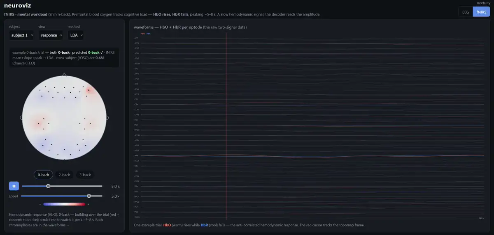

# mindscape — honest, efficient non-invasive neural decoding (EEG + fNIRS)

**What this is.** mindscape decodes non-invasive neural signals — **EEG and fNIRS** — and asks the question
most demos skip: *a decoder that scores ~60% on a subject's own recordings — how far does it fall on a
person it never saw?* The contribution is the **honest cross-subject evaluation** (and what it reveals), not
a leaderboard number — across two tasks:

- **Motor imagery** (EEG, BCI-2a). CSP+LDA hits **0.598 within-subject** but drops to **0.391**
  leave-one-subject-out — a **21-point generalization gap** (chance 25%) — which Riemannian **re-centering**
  then closes (→ **0.501**). The gap measured *and* fixed.
- **Mental workload** (Shin n-back — EEG · fNIRS · fusion). Both modalities decode the *same* task, so
  differences are the modality not the task. Honest cross-subject accuracy is near-floor (anchored to the
  BenchNIRS benchmark), but the two modalities are genuinely **complementary** — an oracle picking the right
  one per block hits **0.69** vs best-single **0.47**. Yet **no fusion — naive, learned, or calibrated —
  cashes that headroom**, because a decoder's confidence doesn't track its correctness. A rigorous
  negative-with-direction, plus a real transfer lever found on the way (per-subject calibration lifts EEG
  band-power **0.41 → 0.51** cross-subject — the workload-task analog of the re-centering above).

Two through-lines under both tasks: the **evaluation regime is the product** — a split is a *criteria filter*
over the data cloud, so every run self-documents exactly what it held out — and **deployability**: the
decoders are edge-tiny and export to ONNX at millisecond-scale CPU latency.

It's also how **I'm** ramping into neural decoding: built on public data, the signal-processing /
calibration / edge-inference discipline carried from prior ML work, the **neuroscience and decoding methods
learned as I go.** Next: input-level learned fusion (to chase that oracle headroom) + harder semantic
decoding. Full plan → **[docs/PLAN.md](docs/PLAN.md)**.

## See the signal the decoder reads — [neuroviz](neuroviz/)


One dependency-free viewer, organized **task → modality** (matching the two tasks below). **Motor imagery**
→ EEG (mu/beta ERD topomaps + CSP/Riemann patterns). **Mental workload** → three approaches on the same
n-back task: **EEG** (frontal-theta / parietal-alpha band-power topomaps), **fNIRS** (the HbO/HbR hemodynamic
response building over the trial), and **Fusion** — a per-block **complementarity map** colouring every
held-out block by which modality got it right, so you see EEG and fNIRS failing on *different* blocks (oracle
0.69 vs best-single 0.47) while naive fusion cashes none of it. Each view shows the signal a decoder consumes
*and whether it got it right* — with the honest cross-subject score. → **[neuroviz/](neuroviz/)**

## Task · Motor imagery (BCI-2a, EEG) — the generalization gap, measured
The science layer is **signal → preprocess → decode → evaluate**, and the *evaluation regime* is the
point. Every decoder is one `(fit_fn, score_fn)` pair fed through a single harness; the **regime** —
within-subject, cross-subject (leave-one-subject-out), cross-session — is a **criteria filter over the
data cloud**, so each run self-documents exactly what it held out. That's what separates a real
generalization number from an inflated one.

**The headline** (CSP+LDA, honest train-session → eval-session protocol):

| regime | accuracy | kappa | ECE |
|---|---|---|---|
| within-subject | **<!--r:csp_lda_within_bnci2014_001.acc-->0.598<!--/r-->** | <!--r:csp_lda_within_bnci2014_001.kappa-->0.464<!--/r--> | <!--r:csp_lda_within_bnci2014_001.ece-->0.140<!--/r--> |
| **cross-subject (leave-one-subject-out)** | **<!--r:csp_lda_cross_subject_bnci2014_001.acc-->0.391<!--/r-->** | <!--r:csp_lda_cross_subject_bnci2014_001.kappa-->0.189<!--/r--> | <!--r:csp_lda_cross_subject_bnci2014_001.ece-->0.134<!--/r--> |
| **gap** | **<!--r:csp_lda_cross_subject_bnci2014_001.acc-csp_lda_within_bnci2014_001.acc-->−0.206<!--/r-->** | <!--r:csp_lda_cross_subject_bnci2014_001.kappa-csp_lda_within_bnci2014_001.kappa-->−0.275<!--/r--> | |

The mean understates it: per subject, cross-subject accuracy spans **0.24–0.55**, and one subject lands
**below chance** on a person it never saw (two more within a few points of it). A "working" motor-imagery
BCI is near-useless on several unseen users — the trap the field underreports and any deployment hits first.

**Calibration under shift.** Temperature scaling fit on an in-session validation split, ECE measured
before/after on the *cross-session* test (ATCNet): test ECE **0.113 → 0.084**. We report the *transfer* —
whether an in-session calibration fix survives the session shift — not a single in-distribution ECE.
([`neuroscan/evaluation/calibrate.py`](neuroscan/evaluation/calibrate.py))

**Closing the cross-subject gap — measured, identified, fixed.** The collapse is a *domain shift*: each
subject's covariance cloud sits at a different location on the SPD manifold, so a classifier trained on
others misses them — not because the ERD contrast differs, but because the cloud is *displaced*. The
field's fix is **Riemannian re-centering** (Zanini et al. 2018): congruence-transport every subject's
covariances to the identity by their own Riemannian mean (`C → M⁻¹ᐟ² C M⁻¹ᐟ²` — the manifold version of
whitening), target included and **unsupervised**. We implemented it ([`neuroscan/tasks/motor_imagery/align.py`](neuroscan/tasks/motor_imagery/align.py)):

| method (leave-one-subject-out) | cross-subject acc |
|---|---|
| CSP+LDA | <!--r:csp_lda_cross_subject_bnci2014_001.acc-->0.391<!--/r--> |
| Riemann (tangent space) | <!--r:riemann_cross_subject_bnci2014_001.acc-->0.360<!--/r--> |
| Riemann ACM (time-delay cov) | <!--r:riemann_acm_cross_subject_bnci2014_001.acc-->0.355<!--/r--> |
| **Riemann + re-centering** | **<!--r:riemann_recenter_ts_bnci2014_001.acc-->0.501<!--/r-->** |

**+0.141** over plain tangent space — the displacement *was* the gap. And it's the *location*, not the
features: ACM (richer time-delay covariances) scores 0.355 alone and **0.471 even with re-centering** —
below plain re-centered tangent space (0.501). Removing the per-subject location shift is what transfers;
adding features on top doesn't. (Re-centering is unsupervised on the target → deployment-real.)

### The decoders — measured (same BCI-2a task, commodity architectures)
We reproduce *standard* architectures (the decoder is commodity); the contribution is the eval rigor and
the efficient deployable, not a leaderboard number. **All our numbers sit below the published ceilings —
deliberately**: the honest train→eval-session protocol is harder than the pooled within-session CV many
papers report, and we don't do full per-model tuning or run-averaging. The gap analysis, grounded in
primary sources, is in [`research/`](research/deep_dives/2026-06-30_2a_sota_recipe.md).

Params + FLOPs at the real input (22 ch × 1125 samples, batch 1; FLOPs via fvcore, latency torch CPU
single-thread — `python -m neuroscan.models.profile`):

| model | role | params | FLOPs | CPU latency | within-subj acc | kappa |
|---|---|---|---|---|---|---|
| CSP+LDA | baseline | — | — | — | <!--r:csp_lda_within_bnci2014_001.acc-->0.598<!--/r--> | <!--r:csp_lda_within_bnci2014_001.kappa-->0.464<!--/r--> |
| **Riemann (tangent space + LR)** | baseline | — | — | — | **<!--r:riemann_within_bnci2014_001.acc-->0.655<!--/r-->** | **<!--r:riemann_within_bnci2014_001.kappa-->0.541<!--/r-->** |
| **EEGNet** | compact CNN | **3.7K** | 13.7M | 1.5 ms | 0.606 | 0.475 |
| **ATCNet** | attention + TCN | 114K | **2.8M** | 4.2 ms | 0.619 | 0.492 |
| EEGConformer | transformer | 871K | 72M | 4.2 ms | — | — |

Three honest findings fall out:
- **Classical geometry leads within-subject on this protocol — read it as strong-and-cheap, not a settled verdict.**
  Riemannian tangent-space + LR ([`baselines/riemann.py`](baselines/riemann.py)) hits **0.655**, above both deep
  nets *as run here* — but this is a single seed, no per-model tuning, and the nets aren't optimized, over ~24h of
  runs. So it's not a fair head-to-head; it's consistent with the textbook BCI-2a finding that per-trial
  *covariance* on a curved manifold is hard to beat when per-subject data is tiny (~288 trials), and it says the
  classical baseline is a strong, cheap floor to clear — not that DL loses. But its
  *cross-subject* score is **0.360**, no better than CSP (0.391): plain tangent space doesn't transfer — the
  manifold **re-centering** closes that gap (→ 0.501; see the transfer table above).
- **Tiny doesn't cost accuracy here.** The 3.7K-parameter EEGNet lands ~1 point behind the 30×-larger
  ATCNet (0.606 vs 0.619) on the same protocol — single seed, no per-model tuning, no error bars, so read
  it as *comparable, not distinguishable* rather than a significance claim: the edge-deployable model gives
  up little at this scale.
- **Already edge-sized.** These nets are ~26 KB as ONNX with sub-ms inference; the optional edge-deploy tail
  exports with a **parity gate** (fp32 ONNX must match torch < 1e-3) and benchmarks INT8 — which *adds* overhead
  at this scale rather than saving. The deploy story isn't "shrink it," it's "already small, measured."
  ([`core/export_onnx.py`](core/export_onnx.py), [`neuroscan/tasks/motor_imagery/quantize.py`](neuroscan/tasks/motor_imagery/quantize.py))

**Published ceilings** (cited, not chased): FBCSP 0.65 · EEGNet 0.70 · ShallowConvNet 0.74 · ATCNet 0.81 ·
transformer SOTA 0.88; cross-subject SOTA 0.74.

## Task · Mental workload / n-back (Shin) — one task, three approaches: EEG · fNIRS · fusion
Decode **mental workload** — which n-back load (0/2/3-back) a subject holds in working memory — from the
Shin hybrid set, where EEG and fNIRS were recorded **simultaneously**. So both modalities decode *one
identical task*, and any difference below is the **modality, not the task** — the clean comparison the
motor-imagery EEG couldn't give (different task, different chance). Same harness; only the adapter + decoder
change.

**n-back workload** (Shin · 26 subjects · 3-class · **chance 0.333**):

| modality · method | cross-subject (LOSO) | within (held-out block-series) |
|---|---|---|
| **fNIRS · mean+slope+peak → LDA** | **<!--r:fnirs_lda_cross_subject_shin2017_nback.acc-->0.454<!--/r-->** (κ 0.16) | **0.415** (κ 0.12) |
| EEG · CSP + LDA | <!--r:csp_lda_cross_subject_shin2017_nback_eeg.acc-->0.432<!--/r--> (κ 0.12) | <!--r:csp_lda_within_shin2017_nback_eeg.acc-->0.568<!--/r--> (κ 0.35) |
| EEG · Riemann (tangent space) | <!--r:riemann_cross_subject_shin2017_nback_eeg.acc-->0.452<!--/r--> (κ 0.14) | <!--r:riemann_within_shin2017_nback_eeg.acc-->0.538<!--/r--> (κ 0.31) |

_On the "within" column — read it as a **soft** ceiling._ The Shin n-back is **one ~33-min continuous
recording** per subject, split into 3 block-series (9 blocks each); "within" holds out the last series, so
train and test are the *same recording* minutes apart — a temporal-generalization test, **not** a separate
session like the BCI-2a two-day protocol. So the within numbers (EEG 0.57 especially) are a lenient ceiling;
the EEG within≫cross gap is directionally real but partly flattered by that temporal proximity.

**Anchored to the field's honest benchmark — the numbers are modest by design.** [BenchNIRS](https://doi.org/10.3389/fnrgo.2023.994969)
(Benerradi 2023) is the rigorous fNIRS-ML benchmark whose whole point is that *proper* cross-subject
evaluation gives near-chance results — exposing that many published fNIRS accuracies are inflated by
improper (within-session / personalised) validation. On this exact Shin n-back it reports LDA **0.389**
(3-class). We reproduced its pipeline on our data (**0.392**;
[`repro_benchnirs`](neuroscan/tasks/workload/repro_benchnirs.py)), then ran our `fnirs_lda` under its *matched*
5-fold GroupKFold protocol: **<!--r:fnirs_lda_cross_subject_kfold_shin2017_nback.acc-->0.474<!--/r-->**
(**+8.2 pp** over that anchor), and LOSO **<!--r:fnirs_lda_cross_subject_shin2017_nback.acc-->0.454<!--/r-->**
(**+6.2 pp**). That margin is wider than the *modest* gap an earlier run showed (0.429) — the difference is
the val-carve fix: the folds now train on the full non-test set instead of silently discarding a 20 % slice,
which a shrinkage-LDA on ~13-dim features converts into a few points. Read it conservatively: the lift over
plain LDA comes from **full spatial resolution + shrinkage** and **more training data**, not a new method — and
even at 0.474 we sit only **~14 pp above the 0.333 floor**, still an order of magnitude short of the 70–90 %
that improper (within-session / personalised) validation produces. Honest, reproducible, above the rigorous
benchmark for explainable reasons — *not* a leap.

Two findings from the same-task design:
- **Method–signal match is modality-specific.** On EEG, covariance methods **work** — CSP/Riemann read the
  workload's band-power (frontal theta / parietal alpha) covariance, above chance. On fNIRS, *naive
  raw-signal* covariance sits at chance (our covariance-mismatch run): the workload is the **mean HbO
  amplitude**, which raw covariance centers away, so amplitude features (mean/slope/peak) → LDA is the right
  tool here. (Not a categorical law — Riemannian-*done-right* decodes fNIRS *motor imagery* within-subject,
  Näher 2025; it's just unproven for workload / cross-subject. See [`research/`](research/deep_dives/2026-07-01_fnirs_decoding_sota.md).)
- **Modest signal — read within-vs-cross carefully.** EEG within (0.54–0.57) clearly exceeds cross
  (0.41–0.43): real subject-specific spatial structure. fNIRS sits ~0.42 *both*, only ~9 pp above chance —
  weak either way, so the within≈cross similarity is as much "little signal to lose" as any stereotypy, and
  the tiny per-subject test sets (9 epochs) make the ordering noisy. The honest read: **fNIRS workload barely
  transfers cross-subject** (exactly what BenchNIRS found), and we reproduce that. Whether the weak fNIRS
  signal nonetheless *adds* to EEG is the **fusion question** — answered below: naive fusion gains nothing,
  yet the modalities are genuinely **complementary** (near-independent errors), so learned fusion is warranted.
- **The field's transfer trick didn't help here.** Per-subject z-scoring (the standard fNIRS cross-subject
  fix) gave no gain — a slight drop on this single run — most likely because our per-epoch baseline-correction
  already removes the offset it targets. (One run, not a claim that z-scoring is useless.)

### Fusion — the second modality *does* carry independent signal; naive fusion just can't use it
Both decoders run on the **same aligned epochs** (EEG Riemann tangent-space + fNIRS mean/slope/peak), so
fusion is a clean test — under one **5-fold GroupKFold** so all four roles share identical folds (fusion needs
per-epoch EEG↔fNIRS pairing, which LOSO's single-subject test sets make too small to read):

| role (5-fold GroupKFold, matched folds) | acc | vs best single |
|---|---|---|
| chance | 0.333 | — |
| EEG alone (Riemann) | <!--r:fusion_cross_subject_kfold_shin2017_nback.eeg-->0.430<!--/r--> | — |
| **fNIRS alone (mean/slope/peak → LDA)** | **<!--r:fusion_cross_subject_kfold_shin2017_nback.fnirs-->0.474<!--/r-->** | best |
| Late fusion (avg probabilities) | <!--r:fusion_cross_subject_kfold_shin2017_nback.late-->0.468<!--/r--> | **−0.006** |
| Feature fusion (concat → LDA) | <!--r:fusion_cross_subject_kfold_shin2017_nback.feature-->0.434<!--/r--> | **−0.040** |

Naively, this reads as a null — **neither fusion beats fNIRS alone**. But that's the wrong conclusion, and the
**complementarity diagnostic** shows why: the two modalities are near-equal (EEG 0.430 ≈ fNIRS 0.474, both
clearly above chance) and they **fail on different blocks**.

| complementarity (same 5-fold) | value |
|---|---|
| best single modality | <!--r:fusion_cross_subject_kfold_shin2017_nback.best_single-->0.474<!--/r--> |
| late fusion (what naive averaging gets) | <!--r:fusion_cross_subject_kfold_shin2017_nback.late-->0.468<!--/r--> |
| **oracle — *either* modality correct** | **<!--r:fusion_cross_subject_kfold_shin2017_nback.oracle_either-->0.688<!--/r-->** |
| oracle headroom over best single | **<!--r:fusion_cross_subject_kfold_shin2017_nback.oracle_either-fusion_cross_subject_kfold_shin2017_nback.best_single-->+0.214<!--/r-->** |
| error correlation (φ) | <!--r:fusion_cross_subject_kfold_shin2017_nback.err_corr-->0.053<!--/r--> |
| EEG-only-right / fNIRS-only-right / both-wrong | 0.215 / 0.255 / <!--r:fusion_cross_subject_kfold_shin2017_nback.both_wrong-->0.312<!--/r--> |

**The signal for fusion is there.** A per-trial oracle that always picked the right modality would hit
**0.688** — **+21 pts** over the best single decoder — and the errors are near-independent (φ ≈ 0.05): EEG
uniquely rescues ~21 % of blocks, fNIRS ~26 %, and both miss only ~31 %. So the ceiling here is **not the
data** — it's the **fusion mechanism**. But which mechanism? We swept every **output-space** combiner, cheap
to learned, each fit without touching test data (stacking + temperature on an inner GroupKFold over the train
subjects):

| output-space aggregator | acc | vs best single |
|---|---|---|
| mean (late) | <!--r:fusion_cross_subject_kfold_shin2017_nback.mean-->0.469<!--/r--> | −0.005 |
| product (naïve Bayes) | <!--r:fusion_cross_subject_kfold_shin2017_nback.product-->0.463<!--/r--> | −0.011 |
| confidence-weighted | <!--r:fusion_cross_subject_kfold_shin2017_nback.conf_weight-->0.467<!--/r--> | −0.007 |
| max-confidence pick | <!--r:fusion_cross_subject_kfold_shin2017_nback.maxconf_pick-->0.462<!--/r--> | −0.013 |
| stacking (meta-LDA, nested CV) | <!--r:fusion_cross_subject_kfold_shin2017_nback.stacking-->0.469<!--/r--> | −0.005 |
| calibrated mean | <!--r:fusion_cross_subject_kfold_shin2017_nback.cal_mean-->0.469<!--/r--> | −0.005 |
| calibrated conf-weighted | <!--r:fusion_cross_subject_kfold_shin2017_nback.cal_conf_weight-->0.467<!--/r--> | −0.007 |

**Every one loses to fNIRS alone** — including *learned* stacking and *temperature-calibrated* weighting. The
reason is a single measured fact: **confidence does not predict correctness.** A modality's peak probability
is barely higher when it's right than when it's wrong (gap: EEG **+<!--r:fusion_cross_subject_kfold_shin2017_nback.eeg_conf_gap-->0.023<!--/r-->**,
fNIRS **+<!--r:fusion_cross_subject_kfold_shin2017_nback.fnirs_conf_gap-->0.038<!--/r-->**), and calibration
doesn't fix the *ordering*, only the scale. So the reliability signal a per-trial selector needs **is not in
the probabilities at all** — no output-space rule can recover the oracle headroom.

That localizes the fix precisely: capturing it needs a gate that reads the **input signals** (raw EEG/fNIRS),
not the decisions — i.e. **learned cross-modal attention** (MBC-ATT, TSMMF-style), which can learn per-trial
reliability from features the probabilities don't expose. Now motivated by a concrete target (close the
0.468 → 0.688 gap) *and* a proven reason the cheap paths can't. The honest, forward-looking result:
*complementarity demonstrated, every output-space fusion insufficient (and why), input-level learned fusion
warranted.*

**A transfer lever found on the way — and fusion's last stand.** On the EEG side, three *zero-calibration*
feature families — covariance (CSP/Riemann), absolute band-power, relative band-power — all land ~0.43
cross-subject; workload band-power is subject-idiosyncratic in **absolute scale**, which points straight at
the fix. Adding **per-subject unsupervised calibration** (z-score each subject by its own feature statistics —
no labels, the EEG analog of the Riemannian re-centering that closed the motor-imagery gap) recovers EEG
band-power to **<!--r:calibration_ablation_shin2017_nback_eeg.eeg_zcalib-->0.511<!--/r-->** (honest
held-out-calibration-half) up to **<!--r:calibration_ablation_shin2017_nback_eeg.eeg_ztrans-->0.581<!--/r-->**
(transductive), from <!--r:calibration_ablation_shin2017_nback_eeg.eeg_raw-->0.407<!--/r--> raw — so the ~0.43
number is the *zero-calibration* floor, not a ceiling, and with calibration **EEG (0.51–0.58) becomes the
stronger modality**, above fNIRS (~0.47, which doesn't benefit — its per-epoch baseline correction already
removes the offset). Crucially, **fusion still doesn't beat that best single modality even after the fix**: a
compact input-level gate (per-modality encoders + a per-trial mixing gate, nested GroupKFold) scores
**<!--r:fusion_gate_cross_subject_kfold_shin2017_nback.gate-->0.573<!--/r-->** — tying z-scored-EEG-alone
(<!--r:calibration_ablation_shin2017_nback_eeg.eeg_z_best-->0.581<!--/r-->), capturing none of the (now larger,
<!--r:calibration_ablation_shin2017_nback_eeg.oracle_z-->0.766<!--/r-->) oracle headroom — the learned gate
fails for the same reason every output-space combiner did.

Two honesty caveats. (1) The oracle is an **upper bound** — a perfect selector is unattainable; a real gate
captures only a fraction. It proves headroom *exists*, not that we can claim it. (2) The literature offers no
free lunch: every published Shin n-back fusion number (96–98 %) is **within-subject** (inflated exactly as
BenchNIRS predicts), the one honest EEG-fNIRS fusion LOSO figure *drops* 34 pts (DC-AGIN 96.98 %→62.56 %), and
on the hardest real contrast (2- vs 3-back) fusion *loses* to fNIRS — so a learned model must be small
(compact cross-attention, the only thing that fits n=26) and gated on **strict nested GroupKFold**, or it will
reproduce that collapse.

Full audit + citations: [`research/`](research/deep_dives/2026-07-01_eeg_fnirs_fusion_sota.md); the calibration
ablation in [`tasks/workload/calibration_ablation.py`](neuroscan/tasks/workload/calibration_ablation.py), the
gate in [`tasks/workload/fusion_gate.py`](neuroscan/tasks/workload/fusion_gate.py).

## Honest limits (measured, not assumed)
Competent on a public benchmark, **not** a finished system:
- **Reproduction is partial.** Best within-subject ~0.62 vs published 0.81; clean subjects reproduce
  (A03 ~0.79 vs published peak ~0.85), hard subjects lag ~0.15 — documented in [`research/`](research/),
  not hidden. The contribution is the measured OOD gap + calibration + efficiency, not the peak.
- **Fusion is a negative result.** On the Shin workload task, complementarity is real but no realizable
  fusion (naive, learned, or calibrated) beats the best single modality — the value is the rigorous null +
  the mechanism, not a win. The input-level gate that *might* cash the oracle headroom is future work.
- **Neuroscience is a ramp.** The signal-processing / eval discipline carries from prior work; the
  decoding methods and neuroscience are learned as I go.
- **Not a device.** Public research data only; no real-time online BCI, no clinical or prospective validation.

## Data
**BCI Competition IV-2a** — 9 subjects, 4-class motor imagery (left/right hand, feet, tongue), 22 EEG
channels @ 250 Hz, 2 sessions × 288 trials — pulled via **[MOABB](https://moabb.neurotechx.com/)** and
kept **outside the repo** (size + licensing). Per-dataset adapters remap to a canonical schema and cache
epochs to a recipe-keyed store; splits are queries over that cloud. One data root, set once:
```bash
cp paths.example.yaml paths.yaml      # then: data: <abs path to a data dir outside the repo>
```
Downloads land under `<root>/raw/`; the epoch cache under `<root>/processed/` (created on first run).

## Quickstart
```bash
uv sync                                              # .venv from pyproject + uv.lock; prefix commands with `uv run`
cp paths.example.yaml paths.yaml                     # set the one data root
# the headline contrast — the same decoder, two regimes:
uv run python -m neuroscan.tasks.run --method csp_lda --regime within --test-session 1test
uv run python -m neuroscan.tasks.run --method csp_lda --regime cross_subject   # the OOD gap
# the strongest classical baseline — covariances on a Riemannian manifold:
uv run python -m neuroscan.tasks.run --method riemann --regime within
# the second modality — fNIRS mental-workload (amplitude features, not covariance):
uv run python -m neuroscan.tasks.workload.run_fnirs --method fnirs_lda --regime cross_subject
# EEG+fNIRS fusion on the same task — complementarity + the aggregation sweep (a rigorous null):
uv run python -m neuroscan.tasks.workload.run_fusion --regime cross_subject_kfold
# a deep decoder, GPU:
uv run python -m neuroscan.tasks.run --method atcnet --regime within --resample 250 --fmin 4 --fmax 40
# the neuroviz demo (EEG / fNIRS / Fusion complementarity view):
uv run python -m neuroviz.export --subject 1 && uv run python -m neuroviz.export_fusion \
  && python -m http.server 8000 -d neuroviz/web
uv run pytest -q
```
Runs log to a local MLflow (`uv run mlflow ui --backend-store-uri sqlite:///mlflow.db`) and write
`runs/<name>/` with an aggregate, a model card, and the run id.

## How motor imagery decodes — the ERD signature
The decodable signal is **event-related desynchronization (ERD)**: imagining a movement *suppresses* mu
(8–12 Hz) and beta (13–30 Hz) rhythms over the **contralateral** sensorimotor cortex — left-hand imagery
desynchronizes the right hemisphere (C4), right-hand the left (C3). CSP learns spatial filters that
maximize this variance contrast (its patterns localize over C3/C4, visible in neuroviz); deep nets learn
it end-to-end. The signature is **subject-specific** — the spatial pattern, the responsive band, and the
SNR all vary per person — which is precisely why cross-subject transfer collapses.

## Tests
```bash
uv run pytest -q          # unit (equivalence-class) + integration (module chains)
```
A pyramid: a wide unit base testing each module by equivalence class (metrics, the split-as-criteria
logic, transforms, calibration, the profiler), and an integration layer for the chains units can't cover
(data cloud → splits → harness end-to-end; decoder → ONNX export → parity).

## How it's built
Agent-driven build, human-owned judgment — coding agents scaffold the plumbing; the modeling decisions,
the measurement correctness, and the evaluation are mine. The architecture (two-layer engine + science,
split-as-criteria, dataset-adapter registry, calibration-under-shift) is carried from a mature prior ML
project of mine; see [`docs/STRUCTURE.md`](docs/STRUCTURE.md). The neuroscience and decoding specifics I
learn as I go.

## References
- **BCI Competition IV-2a** — Tangermann et al., *Review of the BCI Competition IV*, Front. Neurosci. 2012.
- **CSP / FBCSP** — Ang et al., *Filter Bank Common Spatial Pattern (FBCSP) in BCI*, IJCNN 2008 / 2012.
- **EEGNet** — Lawhern et al., *EEGNet: a compact CNN for EEG-based BCIs*, J. Neural Eng. 2018.
- **ShallowConvNet / Deep4Net** — Schirrmeister et al., *Deep learning with CNNs for EEG decoding*, HBM 2017.
- **ATCNet** — Altaheri et al., *Physics-informed attention temporal CNN for EEG-based MI classification*, IEEE TII 2023.
- **MOABB** — Jayaram & Barachant, *MOABB: trustworthy algorithm benchmarking for BCIs*, J. Neural Eng. 2018.
- **Braindecode** — the PyTorch EEG-decoding library the deep models are built on.
