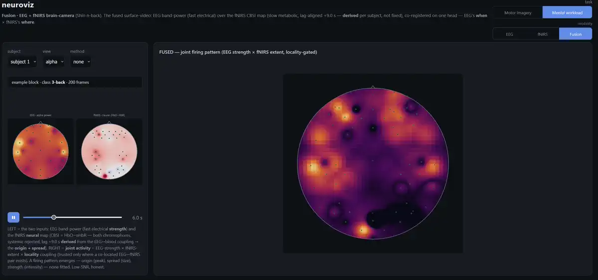

# mindscape — robust, efficient non-invasive neural decoding (EEG + fNIRS)

**What is the format of our thoughts?** Ripples on the mind — a projection of the brain, the most precious
organ we have. What happens in there when we read a word, see a face, decide to move a hand? The field that
reads (and sometimes writes) those signals is **BCI — brain–computer interface** — in two flavors, invasive
and non-invasive.

**Invasive** BCI implants electrodes in the brain: far better resolution, but you can't take it back out, it
reads *and* writes, and the dystopian failure mode writes itself (the *1984* kind). **Non-invasive** BCI reads
from outside — a cap or a scanner — trading resolution for the fact that you can take it off. The two wearable,
affordable options are **EEG** and **fNIRS**:

- **EEG** reads the *cumulative electrical activity* at the scalp — summed action potentials of large neuron
  populations. Fast, spatially blurry.
- **fNIRS** reads *blood*: it shines two infrared wavelengths into cortex and measures the scatter, tracking
  oxygenated vs deoxygenated hemoglobin. A firing region burns ATP, blood rushes in with fresh oxygen — so
  fNIRS sees the *hemodynamic echo* of activity. Slower, spatially sharper.

Complementary — opposite trades on the same question. **mindscape** explores both: the data, its generation,
and the feature-extraction and decoding methods for real tasks — and asks what most demos skip: *a decoder
that scores ~60% on a subject's own recordings — how far does it fall on a person it never saw?* The
contribution is the **robust cross-subject evaluation** (and what it reveals), not a leaderboard number —
across two tasks:

- **Motor imagery** (EEG, BCI-2a). CSP+LDA hits **0.598 within-subject** but drops to **0.391**
  leave-one-subject-out — a **21-point generalization gap** (chance 25%) — which Riemannian **re-centering**
  then largely closes (→ **0.501** zero-shot, ~half the gap; **0.650** with light calibration). The gap
  measured *and* substantially closed, not eliminated.
- **Mental workload** (Shin n-back — EEG · fNIRS · fusion). Both modalities decode the *same* task, so
  differences are the modality not the task. Un-aligned, both sit near-floor (anchored to the BenchNIRS
  benchmark) — but the **same re-centering** from Task 1 lifts EEG **0.45 → 0.60** cross-subject — our biggest
  workload gain, and the strongest single-modality decoder here. That makes fusion a **strong + weak** pair: the
  two still fail on *different* blocks (oracle **0.75** vs best-single **0.58**), and once EEG is well-aligned
  its confidence turns informative, so output-space fusion goes from *hurting* to a marginal edge (product
  **+1.5 pp**) — a wash, not yet a win. The oracle headroom (**+17 pts**) is **real but mostly uncaptured**:
  the complementarity exists, the fusion methods we've tried don't cash it. The graded 2-vs-3 sub-contrast *is*
  at a physiological ceiling (fNIRS reads WM *engagement*, not *level*) — so *that* is capped — but capturing
  the complementarity (boundary-aware / source-space fusion) is untested, not disproven. The honest finding is
  a real gap we haven't closed, not a settled null.

Two through-lines under both tasks: the **evaluation regime is the product** — a split is a *criteria filter*
over the data cloud, so every run self-documents exactly what it held out — and **deployability**: the
decoders are edge-tiny and export to ONNX at millisecond-scale CPU latency.

It's also how **I'm** ramping into neural decoding: built on public data, the signal-processing /
calibration / edge-inference discipline carried from prior ML work, the **neuroscience and decoding methods
learned as I go.** Next: a harder, richer task (semantic decoding) where the signal is present — the fNIRS
graded-*level* result is a measured physiological ceiling (the fusion of its real complementarity stays open),
not an open promise dressed as a win. Full plan →
**[docs/PLAN.md](docs/PLAN.md)**.

## See the signal the decoder reads — [neuroviz](neuroviz/)


One dependency-free viewer, organized **task → modality** (matching the two tasks below). **Motor imagery**
→ EEG (mu/beta ERD topomaps + CSP/Riemann patterns). **Mental workload** → three approaches on the same
n-back task: **EEG** (frontal-theta / parietal-alpha band-power topomaps), **fNIRS** (the HbO/HbR hemodynamic
response building over the trial), and **Fusion** — the EEG+fNIRS **brain-camera**: the fused surface-video
(raw EEG band-power + the fNIRS CBSI neural map → a locality-gated **joint firing pattern**; hemodynamic lag
derived per subject, blood read forward to align to the EEG event). The single-modality views show the signal
a decoder consumes *and whether it got it right* (robust cross-subject score); the fusion view shows the
**physics** — honestly a visualization, not (yet) a decode win (the graded 2-vs-3 contrast is at a
physiological ceiling; what fusion does and doesn't capture is measured below). → **[neuroviz/](neuroviz/)**

## Mapping the field — a working frame for where these tasks sit
This is my attempt to organize non-invasive decoding as I learn it — a working frame, not a settled taxonomy;
others carve it differently. It reads as a ladder ordered by **what** you decode off the signal, where value
seems to climb and tractability to fall as you go up — because the higher rungs lean **endogenous**
(self-generated, weak, un-timed) and the lower ones **exogenous** (stimulus-driven, strong, time-locked,
averageable). The rough principle I keep coming back to: *a decoder works to the degree the signal is driven
by something known.* Corrections welcome.

| axis | what you decode | output | example paradigms | tractability |
|---|---|---|---|---|
| **Control** | intent to *act* | commands (move, select) | motor imagery, P300, SSVEP | works, but low-bandwidth + often gaze-bound |
| **State** | cognitive / affective *state* | monitoring (load, drowsiness) | mental workload / n-back — *passive BCI* | per-subject seems doable; graded levels appear to hit physiological ceilings |
| **Perception** | the *stimulus* being perceived | reconstruct what you see / read | image viewing, reading | **measured** — within decodes, cross lifts with subject count |
| **Communication** | inner *meaning / intent* | language, imagined content | imagined speech / text | the frontier — mostly endogenous, seems hard |

**mindscape works up this ladder.** Three rungs now measured cross-subject (no leaderboard cherry-picking):
**motor imagery = control**, **n-back = state**, and now **perception** — EEG→image on THINGS-EEG2 (a
NICE-style CLIP-retrieval decoder), where within-subject decodes (concept-avg top1 **15%**, 30× chance) but
cross-subject craters and then *lifts with training-subject count* (**2%** train-1 → **6%** train-4 LOSO) —
the same subject-generalization story as motor imagery, in perception
(→ **[neuroscan/tasks/visual/](neuroscan/tasks/visual/)**). **Communication** (EEG→text) is the follow-on
frontier-probe — decode the *reading* phase where signal is real, treat imagined "telepathy" as a probe, not
a promise. The climb → **[docs/PLAN.md](docs/PLAN.md)**.

## Task · Motor imagery (BCI-2a, EEG) — the generalization gap, measured
The science layer is **signal → preprocess → decode → evaluate**, and the *evaluation regime* is the
point. Every decoder is one `(fit_fn, score_fn)` pair fed through a single harness; the **regime** —
within-subject, cross-subject (leave-one-subject-out), cross-session — is a **criteria filter over the
data cloud**, so each run self-documents exactly what it held out. That's what separates a real
generalization number from an inflated one.

**The headline** (CSP+LDA, robust train-session → eval-session protocol):

| regime | accuracy | kappa | ECE |
|---|---|---|---|
| within-subject | **<!--r:csp_lda_within_bnci2014_001.acc-->0.598<!--/r-->** | <!--r:csp_lda_within_bnci2014_001.kappa-->0.464<!--/r--> | <!--r:csp_lda_within_bnci2014_001.ece-->0.140<!--/r--> |
| **cross-subject (leave-one-subject-out)** | **<!--r:csp_lda_cross_subject_bnci2014_001.acc-->0.391<!--/r-->** | <!--r:csp_lda_cross_subject_bnci2014_001.kappa-->0.189<!--/r--> | <!--r:csp_lda_cross_subject_bnci2014_001.ece-->0.134<!--/r--> |
| **gap** | **<!--r:csp_lda_cross_subject_bnci2014_001.acc-csp_lda_within_bnci2014_001.acc-->−0.206<!--/r-->** | <!--r:csp_lda_cross_subject_bnci2014_001.kappa-csp_lda_within_bnci2014_001.kappa-->−0.275<!--/r--> | |

The mean understates it: per subject, cross-subject accuracy spans **0.24–0.55**, and one subject lands
**below chance** on a person it never saw (two more within a few points of it). A "working" motor-imagery
BCI is near-useless on several unseen users — the trap the field underreports and any deployment hits first.

**Calibration under shift.** Temperature scaling fit on an in-session validation split, ECE measured
before/after on the *cross-session* test (ATCNet): test ECE **0.113 → 0.084**. We report the *transfer* —
whether an in-session calibration fix survives the session shift — not a single in-distribution ECE.
([`neuroscan/evaluation/calibrate.py`](neuroscan/evaluation/calibrate.py))

**Closing the cross-subject gap — the RPA ladder, reported by regime.** The collapse is a *domain shift*:
each subject's covariance cloud sits at a different location on the SPD manifold, so a classifier trained on
others misses them — not because the ERD contrast differs, but because the cloud is *displaced*. **Riemannian
Procrustes Analysis** (Rodrigues 2019) aligns the domains in three steps; we report where each sits on the
**deployability axis** — how many *target* labels it needs ([`align.py`](neuroscan/tasks/motor_imagery/align.py)):

| method (leave-one-subject-out) | target labels | cross-subject acc |
|---|---|---|
| CSP+LDA | — | <!--r:csp_lda_cross_subject_bnci2014_001.acc-->0.391<!--/r--> |
| Riemann (tangent space) | — | <!--r:riemann_cross_subject_bnci2014_001.acc-->0.360<!--/r--> |
| **+ re-centering** (RPA step 1, Zanini 2018) | **zero-shot** | **<!--r:riemann_recenter_ts_bnci2014_001.acc-->0.501<!--/r-->** |
| **+ re-scaling** (RPA step 2) | **zero-shot** | **<!--r:riemann_recenter_scale_ts_bnci2014_001.acc-->0.519<!--/r-->** |
| **full RPA** (+ re-rotate, step 3) | calib 10 % | <!--r:riemann_rpa_c10_bnci2014_001.acc-->0.555<!--/r--> |
| **full RPA** | calib 20 % | <!--r:riemann_rpa_c20_bnci2014_001.acc-->0.595<!--/r--> |
| **full RPA** | calib 50 % | **<!--r:riemann_rpa_ts_bnci2014_001.acc-->0.650<!--/r-->** |
| MDWM | calib 50 % | <!--r:riemann_mdwm_ts_bnci2014_001.acc-->0.412<!--/r--> |

Two regimes, read them separately. **Zero-shot** (no target labels — deployment-real): re-centering to the
identity by each subject's own Riemannian mean (`C → M⁻¹ᐟ² C M⁻¹ᐟ²`, the manifold version of whitening)
closes most of the gap, **0.36 → 0.50**; adding dispersion-alignment (re-scaling) nudges it to **0.52**. The
displacement *was* the gap — and it's the *location*, not the features (ACM's richer time-delay covariances
score 0.355 alone, only 0.471 even re-centered). **Calibrated** (a short labelled calibration session): the
supervised re-rotation aligns *class* structure and lifts further — even **10 %** of a session (≈7 trials/class)
reaches **0.555**, scaling to **0.650** at 50 %, approaching the within-subject ceiling (0.60–0.66).

**MDWM is the negative we report — and a lesson in robustness.** At its default weighting it scores 0.412, below
even zero-shot re-centering. Tuning its source↔target tradeoff λ *does* help — but that's the tell: acc swings
**0.31 → 0.57** across λ (`--set params.mdwm_lambda=…`), and the optimum is **λ = 1 (target-only)**, i.e. the best MDWM
*ignores the source entirely* — its transfer mechanism adds nothing here, it's just target-calibration MDM.
A method whose accuracy swings that much with one knob is, all else equal, the harder one to deploy — you'd
have to re-find λ per setting, and a value tuned here needn't transfer. We haven't *shown* that across
datasets (that would need a robustness study we haven't run — a fair thing to note, not a proven ranking);
it's a single-dataset observation plus the general principle that a parameterless method (re-centering: no
knob, no labels) is preferable when it's competitive. So we report MDWM untuned (0.412) — tuning it up would
hide exactly the fragility worth showing.

**The one non-negotiable:** the calibrated methods' labels come from a **disjoint** stratified split of the
held-out subject — fit there, scored on the *remaining* blocks. Test labels never enter the fit; otherwise
"calibrated transfer" is just leakage. (Same discipline as the fNIRS calibration ablation.)

### The decoders — measured (same BCI-2a task, commodity architectures)
We reproduce *standard* architectures (the decoder is commodity); the contribution is the eval rigor and
the efficient deployable, not a leaderboard number. **All our numbers sit below the published ceilings —
deliberately**: the robust train→eval-session protocol is harder than the pooled within-session CV many
papers report, and we don't do full per-model tuning or run-averaging. The gap analysis, grounded in
primary sources, is in [`research/`](research/deep_dives/2026-06-30_2a_sota_recipe.md).

Params + FLOPs at the real input (22 ch × 1125 samples, batch 1; FLOPs via fvcore, latency torch CPU
single-thread — `python -m neuroscan.models.profile`):

| model | role | params | FLOPs | CPU latency | within-subj acc | kappa |
|---|---|---|---|---|---|---|
| CSP+LDA | baseline | — | — | — | <!--r:csp_lda_within_bnci2014_001.acc-->0.598<!--/r--> | <!--r:csp_lda_within_bnci2014_001.kappa-->0.464<!--/r--> |
| **Riemann (tangent space + LR)** | baseline | — | — | — | **<!--r:riemann_within_bnci2014_001.acc-->0.655<!--/r-->** | **<!--r:riemann_within_bnci2014_001.kappa-->0.541<!--/r-->** |
| **EEGNet** | compact CNN | **3.7K** | 13.7M | 1.5 ms | 0.606 | 0.475 |
| **ATCNet** | attention + TCN | 114K | **2.8M** | 4.2 ms | 0.619 | 0.492 |
| EEGConformer | transformer | 871K | 72M | 4.2 ms | — | — |

Three findings fall out:
- **Classical geometry leads within-subject on this protocol — read it as strong-and-cheap, not a settled verdict.**
  Riemannian tangent-space + LR ([`baselines/riemann.py`](baselines/riemann.py)) hits **0.655**, above both deep
  nets *as run here* — but this is a single seed, no per-model tuning, and the nets aren't optimized, over ~24h of
  runs. So it's not a fair head-to-head; it's consistent with the textbook BCI-2a finding that per-trial
  *covariance* on a curved manifold is hard to beat when per-subject data is tiny (~288 trials), and it says the
  classical baseline is a strong, cheap floor to clear — not that DL loses. But its
  *cross-subject* score is **0.360**, no better than CSP (0.391): plain tangent space doesn't transfer — the
  manifold **re-centering** closes that gap (→ 0.501; see the transfer table above).
- **Tiny doesn't cost accuracy here.** The 3.7K-parameter EEGNet lands ~1 point behind the 30×-larger
  ATCNet (0.606 vs 0.619) on the same protocol — single seed, no per-model tuning, no error bars, so read
  it as *comparable, not distinguishable* rather than a significance claim: the edge-deployable model gives
  up little at this scale.
- **Already edge-sized.** These nets are ~26 KB as ONNX with sub-ms inference; the optional edge-deploy tail
  exports with a **parity gate** (fp32 ONNX must match torch < 1e-3) and benchmarks INT8 — which *adds* overhead
  at this scale rather than saving. The deploy story isn't "shrink it," it's "already small, measured."
  ([`core/export_onnx.py`](core/export_onnx.py), [`neuroscan/tasks/motor_imagery/quantize.py`](neuroscan/tasks/motor_imagery/quantize.py))

**Published ceilings** (cited, not chased): FBCSP 0.65 · EEGNet 0.70 · ShallowConvNet 0.74 · ATCNet 0.81 ·
transformer SOTA 0.88; cross-subject SOTA 0.74.

## Task · Mental workload / n-back (Shin) — one task, three approaches: EEG · fNIRS · fusion
Decode **mental workload** — which n-back load (0/2/3-back) a subject holds in working memory — from the
Shin hybrid set, where EEG and fNIRS were recorded **simultaneously**. So both modalities decode *one
identical task*, and any difference below is the **modality, not the task** — the clean comparison the
motor-imagery EEG couldn't give (different task, different chance). Same harness; only the adapter + decoder
change.

**n-back workload** (Shin · 26 subjects · 3-class · **chance 0.333**):

| modality · method | cross-subject (LOSO) | within (held-out block-series) |
|---|---|---|
| fNIRS · mean+slope+peak → LDA | <!--r:fnirs_lda_cross_subject_shin2017_nback.acc-->0.454<!--/r--> (κ 0.16) | 0.415 (κ 0.12) |
| EEG · CSP + LDA | <!--r:csp_lda_cross_subject_shin2017_nback_eeg.acc-->0.432<!--/r--> (κ 0.12) | <!--r:csp_lda_within_shin2017_nback_eeg.acc-->0.568<!--/r--> (κ 0.35) |
| EEG · Riemann (tangent space) | <!--r:riemann_cross_subject_shin2017_nback_eeg.acc-->0.452<!--/r--> (κ 0.14) | <!--r:riemann_within_shin2017_nback_eeg.acc-->0.538<!--/r--> (κ 0.31) |
| **EEG · Riemann + re-centering** (the transfer fix) | **<!--r:riemann_recenter_ts_shin2017_nback_eeg.acc-->0.604<!--/r-->** (κ 0.41) | — |

**The transfer fix carries across tasks — and hits harder here.** The same **Riemannian re-centering** that
closed the motor-imagery gap (Task 1) lifts workload EEG cross-subject from **0.452 → 0.604** (+15 pp, zero-shot,
no target labels) — the biggest single workload gain, and now the strongest single-modality decoder on this
task by far (EEG-recentered 0.60 vs fNIRS 0.47). The near-floor EEG cross-subject numbers were the *unaligned*
covariance clouds; re-centering removes the per-subject location shift the same way it did for MI. (Full RPA
*loses* to plain re-centering here — 0.464 — the rotation over-fits the small 3-class calib slice; a
task-specific negative, opposite of MI where it helped.)

_On the "within" column — read it as a **soft** ceiling._ The Shin n-back is **one ~33-min continuous
recording** per subject, split into 3 block-series (9 blocks each); "within" holds out the last series, so
train and test are the *same recording* minutes apart. Note the re-centered cross-subject number (0.60)
actually *exceeds* the within-subject Riemann (0.54): not a paradox — cross-subject pools **25 aligned
subjects** (~675 blocks) while "within" trains on ~18 blocks of one subject, so alignment + volume beats a
data-starved personal model.

**Anchored to the field's robust benchmark — the numbers are modest by design.** [BenchNIRS](https://doi.org/10.3389/fnrgo.2023.994969)
(Benerradi 2023) is the rigorous fNIRS-ML benchmark whose whole point is that *proper* cross-subject
evaluation gives near-chance results — exposing that many published fNIRS accuracies are inflated by
improper (within-session / personalised) validation. On this exact Shin n-back it reports LDA **0.389**
(3-class). We reproduced its pipeline on our data (**0.392**;
[`repro_benchnirs`](neuroscan/tasks/workload/repro_benchnirs.py)), then ran our `fnirs_lda` under its *matched*
5-fold GroupKFold protocol: **<!--r:fnirs_lda_cross_subject_kfold_shin2017_nback.acc-->0.474<!--/r-->**
(**+8.2 pp** over that anchor), and LOSO **<!--r:fnirs_lda_cross_subject_shin2017_nback.acc-->0.454<!--/r-->**
(**+6.2 pp**). That margin is wider than the *modest* gap an earlier run showed (0.429) — the difference is
the val-carve fix: the folds now train on the full non-test set instead of silently discarding a 20 % slice,
which a shrinkage-LDA on ~13-dim features converts into a few points. Read it conservatively: the lift over
plain LDA comes from **full spatial resolution + shrinkage** and **more training data**, not a new method — and
even at 0.474 we sit only **~14 pp above the 0.333 floor**, still an order of magnitude short of the 70–90 %
that improper (within-session / personalised) validation produces. Robust, reproducible, above the rigorous
benchmark for explainable reasons — *not* a leap.

Two findings from the same-task design:
- **Method–signal match is modality-specific.** On EEG, covariance methods **work** — CSP/Riemann read the
  workload's band-power (frontal theta / parietal alpha) covariance, above chance. On fNIRS, *naive
  raw-signal* covariance sits at chance (our covariance-mismatch run): the workload is the **mean HbO
  amplitude**, which raw covariance centers away, so amplitude features (mean/slope/peak) → LDA is the right
  tool here. (Not a categorical law — Riemannian-*done-right* decodes fNIRS *motor imagery* within-subject,
  Näher 2025; it's just unproven for workload / cross-subject. See [`research/`](research/deep_dives/2026-07-01_fnirs_decoding_sota.md).)
- **EEG cross-subject isn't stuck — re-center it (see Fusion below).** Un-aligned EEG cross (~0.43) sits
  below within (~0.55) — the subject-location-shift story again. **Re-centering flips it to 0.60**, now *above*
  within-subject (25 aligned subjects beat a data-starved personal model). fNIRS stays ~0.47 (barely transfers,
  exactly what BenchNIRS found). So the workload task is a **strong (re-centered EEG) + weak (fNIRS)** pair —
  whether the weak modality *adds* is the **fusion question**, answered below: a marginal edge, large
  uncaptured complementarity — but a stronger fNIRS is *not* on the table here: graded workload is at a
  physiological ceiling (see "The graded-load ceiling" below), so this pair stays strong+weak by physics.

### What actually carries the fNIRS signal — a feature-importance search
The baseline uses **mean + slope + peak**, the field-standard triple. But *which* of those (and which of a
wider bank) actually matters? Rather than guess, we let a search tell us — **Optuna as a wrapper
feature-selector**: 15 per-channel temporal descriptors (mean, slope, peak, variance, skew, kurtosis, AUC,
time-to-peak, min/max/range, early/late slope, zero-crossings), **one weight ∈ [0,1] per family** applied
*after* standardisation, scored by mean accuracy over repeated-seeded subject-grouped 5-fold CV.
[`optuna_search`](neuroscan/tasks/workload/feature_importance/optuna_search.py) · config
[`optuna.yaml`](neuroscan/tasks/workload/feature_importance/optuna.yaml). The study persists to an Optuna
JournalStorage DB (trials persisted + queryable), and the table below is regenerated from the study's
`importance.json` artifact — reproducible from the stored trials, not hand-typed.

**Conservative by construction.** A search *maximises* over trials, so its peak accuracy is optimistic —
it's reported as such (~0.50, **not** a generalisation number; that would need a sealed outer fold). It also
runs a fixed `shrinkage=0.4` LDA (constant across trials, so it can't confound the weight comparison) — a
*different* classifier from the `shrinkage="auto"` LDA in the fixed-recipe CV below, so the ~0.50 here and the
~0.46 there aren't on one scale (search optimism **plus** a classifier difference); only the recipe table is a
fair within-method comparison. The robust deliverable is the **importance** (fANOVA + how much the best trials up-weight each family), and its
**stability** across three independent study re-runs: unstable at 30 trials (top-5 Jaccard **0.20** — search
noise) → **stable at 200 trials (Jaccard 0.67)**, so the ranking below is trustworthy, not a lucky draw.

**Finding — dynamics ≫ amplitude** (200 trials × 3 seeds):

| family | importance | best-trial weight | reading |
|---|---|---|---|
| **slope** | **0.35** | **0.91** | the workhorse — kept on, dominates |
| time-to-peak | 0.25 | 0.22 | influential but best trials **suppress** it (hurts if included) |
| range | 0.13 | 0.41 | moderate |
| late-slope | 0.09 | 0.76 | mild help (response *shape*, not size) |
| **mean** | 0.03 | **0.15** | near-dead — the search **drops** it |
| peak | 0.02 | 0.58 | minor |

The workload signal is in the **rate and shape of the hemodynamic rise (`slope`)**, *not* its magnitude —
`mean` and `peak`, two-thirds of the standard triple, carry almost nothing here (the search actively
down-weights `mean`). Mechanistically clean: `mean` over the −2→20 s window blends baseline + rise + plateau
and dilutes the contrast, while `slope` reads the rise directly — matching the fNIRS literature's emphasis on
regression/slope features. A feature-importance result, not a new accuracy claim.

**Two follow-ups confirmed it — and corrected it.** (a) A **differentiable** version
([`differentiable`](neuroscan/tasks/workload/feature_importance/differentiable.py), torch/CUDA): softmax feature
weights + a linear head trained jointly, with `entropy(w)` as a differentiable sparsity penalty — sweep it
and `slope` is the last family standing. It also exposes a real limit: **per-channel** weights (1080) are
computationally trivial for gradient descent but **statistically unidentifiable** on 702 blocks (they stay
uniform), so the per-family view is the right resolution. (b) A **robust fixed-recipe CV** — no search, so
no selection optimism ([`recipes`](neuroscan/tasks/workload/feature_importance/recipes.py), 3×5-fold GroupKFold):

| recipe | acc | κ |
|---|---|---|
| **dynamics** (slope + early/late-slope) | **<!--r:fnirs_recipe_dynamics_shin2017_nback.acc-->0.466<!--/r-->** | <!--r:fnirs_recipe_dynamics_shin2017_nback.kappa-->0.199<!--/r--> |
| full (15 families) | <!--r:fnirs_recipe_full_shin2017_nback.acc-->0.464<!--/r--> | <!--r:fnirs_recipe_full_shin2017_nback.kappa-->0.196<!--/r--> |
| amplitude — mean+slope+peak (baseline) | <!--r:fnirs_recipe_amplitude_shin2017_nback.acc-->0.460<!--/r--> | <!--r:fnirs_recipe_amplitude_shin2017_nback.kappa-->0.190<!--/r--> |
| slope only | <!--r:fnirs_recipe_slope_only_shin2017_nback.acc-->0.446<!--/r--> | <!--r:fnirs_recipe_slope_only_shin2017_nback.kappa-->0.169<!--/r--> |
| mean only | <!--r:fnirs_recipe_mean_only_shin2017_nback.acc-->0.392<!--/r--> | <!--r:fnirs_recipe_mean_only_shin2017_nback.kappa-->0.088<!--/r--> |
| peak only | <!--r:fnirs_recipe_peak_only_shin2017_nback.acc-->0.376<!--/r--> | <!--r:fnirs_recipe_peak_only_shin2017_nback.kappa-->0.064<!--/r--> |

The **slope *trajectory*** (rise rate + early/late shape, 3 features) **ties the full 15-family bank and edges
the standard triple** — while `mean` and `peak` alone barely clear chance (0.333). So two-thirds of the
field-standard triple is dead weight; the real recipe is *shape, not magnitude*. The correction over the
search: slope-*alone* (0.446) sits a hair *under* the triple — it's the slope trajectory that carries it, not
a single number. (Assume-wrong in action: the search *suggested* slope; the no-search CV *tempered* the claim.)

**Does keeping the time axis help? — a windowed decoder + aggregation sweep.** The baseline collapses the 22 s
response to one scalar/channel. [`WindowedFnirs`](baselines/fnirs/windowed.py) instead sub-windows the
response and combines the windows four ways ([`fnirs_windowed_eval`](neuroscan/tasks/workload/fnirs_windowed_eval.py),
within *and* cross-subject). The result — the aggregation is the design axis, not an afterthought:

- **Ordered concatenation carries real extra signal — within-subject.** Coarse 3-window concat → LDA lifts
  within-subject **0.448 → ~0.473** (+2.5 pp), consistent across every granularity (so a real effect, not
  fold scatter). Keeping time is *not* wasted; the collapse *is* lossy — within a subject.
- **But the gain is subject-idiosyncratic — it doesn't transfer.** Cross-subject, coarse windowing only *ties*
  the collapse (~0.458 vs 0.460); finer windows overfit and drop (down to 0.415). The extra temporal detail is
  per-subject, so it evaporates across subjects.
- **MIL pooling (mean / max / log-sum-exp) is a dead end here** — all ~0.39, *below* collapse even within-subject:
  a smooth hemodynamic response has no localized cue for a "strongest-window" pool to exploit, so a shared
  per-window feature is just weaker than the global triple. Ruled out by measurement.

So the collapse isn't lazy — it's matched to a smooth signal, and the temporal gain it leaves is trapped
*within* subject.
- **The field's transfer trick didn't help here.** Per-subject z-scoring (the standard fNIRS cross-subject
  fix) gave no gain — a slight drop on this single run — most likely because our per-epoch baseline-correction
  already removes the offset it targets. (One run, not a claim that z-scoring is useless.)

### The graded-load ceiling — physiology, not a method gap (the honest finding)
We attacked the ~0.46 cross-subject 3-class number **four ways** — a 15-family feature bank, windowed temporal
representations, CBSI physiological-noise cleaning, and a GLM-β HRF model — and **every one ties the
mean+slope+peak baseline** (~<!--r:fnirs_lda_cross_subject_shin2017_nback.acc-->0.454<!--/r-->), which itself
matches the field benchmark (reproduced BenchNIRS 0.389 → 0.392). The wall is a **single boundary: 2-back vs
3-back is at chance even *within* subject** (Ishii 2013: 0.61 within, 3-class 0.50 within; ours ≈ chance). So
it is **not a transfer problem** — domain adaptation can only move signal that exists within a subject, and
here there is none to move. The mechanism is physiology: a fixed ~2.2 s stimulus SOA + neurovascular
saturation + the inverted-U load response mean 2- and 3-back produce the **same-shaped hemodynamic plateau,
differing only in a tiny, sign-flipping, subject-relative height**. fNIRS reads *whether* working memory is
engaged, not *how hard* — a **load detector, not a meter**.

This closes the "lift the weak modality" path in the fusion section below: there is **no lever here** — DA has
nothing to transfer, and better features can't extract absent signal. And it **matches the field**: we found no
*leakage-free* published result beating ~chance+10 pts on cross-subject Shin n-back (the 0.83–0.96 numbers are
within-subject / leaky splits). The deliverable is the **rigorous negative + the mechanism**, not a number. fNIRS earns its keep
where the hemodynamic response *is* the signal (engagement detection, motion-robust ambulatory BCI); graded WM
*level* cross-subject is a poor task for it. We circle back when better data — generation and
collection — can change the physics we're currently stuck with.

### Fusion — a strong + weak pair; complementarity is real, output-space fusion barely cashes it
Both decoders run on the **same aligned epochs** — EEG **re-centered Riemann** (the transfer fix, zero-shot
per-subject) + fNIRS mean/slope/peak — under one **5-fold GroupKFold** so every role shares identical folds
(fusion needs per-epoch EEG↔fNIRS pairing, which LOSO's single-subject test sets make too small to read):

| role (5-fold GroupKFold, matched folds) | acc | vs best single |
|---|---|---|
| chance | 0.333 | — |
| fNIRS (mean/slope/peak → LDA) | <!--r:fusion_cross_subject_kfold_shin2017_nback.fnirs-->0.474<!--/r--> | −0.106 |
| **EEG (re-centered Riemann)** | **<!--r:fusion_cross_subject_kfold_shin2017_nback.eeg-->0.580<!--/r-->** | best |
| Late fusion (avg probabilities) | <!--r:fusion_cross_subject_kfold_shin2017_nback.late-->0.587<!--/r--> | **+0.007** |
| Feature fusion (concat → LDA) | <!--r:fusion_cross_subject_kfold_shin2017_nback.feature-->0.564<!--/r--> | −0.016 |

Re-centering flips the workload EEG from near-floor to the **strong** modality (0.58 vs fNIRS 0.47 — this is
the 5-fold number; the LOSO number in Table B is 0.60, a touch higher from more training data per fold), so
this is a **strong + weak** pair. Late fusion (0.587) now **edges** the best single (+0.7 pp) rather than *losing* to
it — but that margin is within fold noise, so read it as a **wash-to-slight-edge, not a clean win**. Feature
fusion (0.564, concatenating the re-centered EEG tangent-space feature + fNIRS amplitude) lands just under the
best single — a fair feature-level result, not a broken one. The interesting question is the **complementarity**
— the two modalities still **fail on different blocks**:

| complementarity (same 5-fold) | value |
|---|---|
| best single modality | <!--r:fusion_cross_subject_kfold_shin2017_nback.best_single-->0.580<!--/r--> |
| late fusion (what naive averaging gets) | <!--r:fusion_cross_subject_kfold_shin2017_nback.late-->0.587<!--/r--> |
| **oracle — *either* modality correct** | **<!--r:fusion_cross_subject_kfold_shin2017_nback.oracle_either-->0.752<!--/r-->** |
| oracle headroom over best single | **<!--r:fusion_cross_subject_kfold_shin2017_nback.oracle_either-fusion_cross_subject_kfold_shin2017_nback.best_single-->+0.172<!--/r-->** |
| error correlation (φ) | <!--r:fusion_cross_subject_kfold_shin2017_nback.err_corr-->0.107<!--/r--> |
| EEG-only-right / fNIRS-only-right / both-wrong | 0.28 / 0.17 / <!--r:fusion_cross_subject_kfold_shin2017_nback.both_wrong-->0.248<!--/r--> |

**The headroom is large and mostly uncaptured.** A per-trial oracle picking the right modality would hit
**0.752** — **+17 pts** over the best single — with near-independent errors (φ ≈ 0.11): EEG uniquely rescues
~28 % of blocks, fNIRS ~17 %, only ~25 % beat both. So the ceiling isn't the data, it's the **fusion
mechanism**. We swept every **output-space** combiner (stacking + temperature fit on an inner GroupKFold over
the train subjects — no test leakage):

| output-space aggregator | acc | vs best single |
|---|---|---|
| mean (late) | <!--r:fusion_cross_subject_kfold_shin2017_nback.mean-->0.587<!--/r--> | +0.007 |
| **product (naïve Bayes)** | **<!--r:fusion_cross_subject_kfold_shin2017_nback.product-->0.595<!--/r-->** | **+0.015** |
| confidence-weighted | <!--r:fusion_cross_subject_kfold_shin2017_nback.conf_weight-->0.580<!--/r--> | ±0.000 |
| max-confidence pick | <!--r:fusion_cross_subject_kfold_shin2017_nback.maxconf_pick-->0.591<!--/r--> | +0.011 |
| stacking (meta-LDA, nested CV) | <!--r:fusion_cross_subject_kfold_shin2017_nback.stacking-->0.587<!--/r--> | +0.007 |
| calibrated mean | <!--r:fusion_cross_subject_kfold_shin2017_nback.cal_mean-->0.587<!--/r--> | +0.007 |
| calibrated conf-weighted | <!--r:fusion_cross_subject_kfold_shin2017_nback.cal_conf_weight-->0.580<!--/r--> | ±0.000 |

**Several combiners now marginally *beat* best-single (product +1.5 pp)** — a real shift from the earlier
weak+weak version, where *every* combiner lost. The reason is mechanistic: re-centering didn't just raise EEG
accuracy, it made EEG's **confidence informative**. The correct-vs-wrong peak-probability gap is now
**+<!--r:fusion_cross_subject_kfold_shin2017_nback.eeg_conf_gap-->0.132<!--/r-->** for EEG (was ~0.02 unaligned)
vs **+<!--r:fusion_cross_subject_kfold_shin2017_nback.fnirs_conf_gap-->0.038<!--/r-->** for fNIRS — so
confidence-based combiners (product, max-pick) can *partially* tell which modality to trust. The lesson:
**output-space fusion works to the extent the modalities are well-calibrated**, and it fails when confidence
is noise (the weak-modality regime).

But the gains are within noise and a long way under the oracle (0.752). The intuitive fix — **lift the weak
modality** (fNIRS cross-subject DA → a *strong + strong* pair) — turns out to be closed: fNIRS graded workload
is at a **physiological ceiling** (see "The graded-load ceiling" above), so there is nothing to lift. The only
remaining route is an input-level gate that reads reliability from the raw signals, not the probabilities — and
we tried it (below); it also cashes ~none. The current result: *re-centering makes fusion stop hurting and
marginally help, complementarity is large but mostly uncaptured, and — measured — the combiners we've tried
don't cash it on this strong+weak pair (boundary-aware / source-space routes untested).*

**A second, independent EEG fix — and the input-gate we tried.** Re-centering the *covariance* is one route;
the *band-power* features have their own. Workload band-power is subject-idiosyncratic in absolute scale, so
per-subject unsupervised calibration (z-score each subject's own features — the feature-space analog of
re-centering) recovers it from <!--r:calibration_ablation_shin2017_nback_eeg.eeg_raw-->0.407<!--/r--> raw to
**<!--r:calibration_ablation_shin2017_nback_eeg.eeg_zcalib-->0.511<!--/r-->** (held-out calibration-half — no leakage)
/ **<!--r:calibration_ablation_shin2017_nback_eeg.eeg_ztrans-->0.581<!--/r-->** (transductive) — a second,
independent way to reach the same ~0.58 EEG strength. We also built the **input-level gate** (path 2 above —
per-modality encoders + a per-trial mixing gate, nested GroupKFold) on those features:
**<!--r:fusion_gate_cross_subject_kfold_shin2017_nback.gate-->0.573<!--/r-->**, *tying* z-scored-EEG-alone
(<!--r:calibration_ablation_shin2017_nback_eeg.eeg_z_best-->0.581<!--/r-->) — it captured none of that oracle
headroom (<!--r:calibration_ablation_shin2017_nback_eeg.oracle_z-->0.766<!--/r-->) either. So even reading the
raw inputs, the gate doesn't cash it *on this strong+weak pair* — and, per the ceiling section, a stronger
fNIRS isn't available to make it strong+strong on the graded contrast. Capturing the complementarity that *does*
exist (boundary-aware routing, source-space fusion) is the open method — not something we've measured shut.

Two caveats. (1) The oracle is an **upper bound** — a perfect selector is unattainable; a real gate
captures only a fraction. It proves headroom *exists*, not that we can claim it. (2) The literature offers no
free lunch: every published Shin n-back fusion number (96–98 %) is **within-subject** (inflated exactly as
BenchNIRS predicts), the one leakage-free EEG-fNIRS fusion LOSO figure *drops* 34 pts (DC-AGIN 96.98 %→62.56 %), and
on the hardest real contrast (2- vs 3-back) fusion *loses* to fNIRS — so a learned model must be small
(compact cross-attention, the only thing that fits n=26) and gated on **strict nested GroupKFold**, or it will
reproduce that collapse.

Full audit + citations: [`research/`](research/deep_dives/2026-07-01_eeg_fnirs_fusion_sota.md); the calibration
ablation in [`tasks/workload/calibration_ablation.py`](neuroscan/tasks/workload/calibration_ablation.py), the
gate in [`tasks/workload/fusion_gate.py`](neuroscan/tasks/workload/fusion_gate.py).

## Task · Perception (EEG→image on THINGS) — the over-reporting audit

Third rung of the ladder: decode the *seen image* from EEG. A NICE-style encoder maps each EEG epoch to the
viewed image's CLIP embedding (InfoNCE), then retrieves zero-shot among the 200 held-out THINGS test concepts
(chance **0.5%**). The contribution here is **not** a leaderboard top-k — it's an honest audit of *how much the
field's usual numbers inflate*, plus the hardest generalization test the two THINGS-EEG datasets allow.

**The inflation grid** ([`retrieval_audit.py`](neuroscan/tasks/visual/retrieval_audit.py)) — the same encoder,
scored four ways. The commonly-quoted cell (within-subject, concept-averaged) vs the defensible one
(cross-subject, single-trial):

| top-1 | single-trial | concept-averaged |
|---|---|---|
| **within-subject** | ~4% | **~15%** ← usually quoted |
| **cross-subject** | **~2%** ← robust | ~6% |

Two independent leaks stack: seeing the test *person* (within→cross) and averaging test *repeats* — together an
**~8× gap** between the headline and the honest number. Cross-subject *does* lift with training-subject count
(2% train-1 → 6% train-4 LOSO), the same subject-generalization story as motor imagery.

**Zero-shot is verified, not assumed** — the train/test concept sets are checked to be disjoint on concept
*names* (1,654 train / 200 test / **0 overlap**; comparing split-local indices would have falsely flagged all
200). **Confidence calibration** ([`evaluation/retrieval.py`](neuroscan/evaluation/retrieval.py)) asks the
deployable question the top-k can't: when the retrieval is confident, is it right? — ECE + a hit-vs-miss
confidence gap.

**Cross-dataset zero-shot** ([`cross_dataset_eval.py`](neuroscan/tasks/visual/cross_dataset_eval.py)) — the
hardest honest test: train on **THINGS-EEG1** (Grootswagers, ds003825 — 50 subjects, 63-ch BrainVision @10 Hz
RSVP, [adapter](core/data/eeg/things_eeg1.py) real-data validated) and retrieve on **THINGS-EEG2** — different
people, different rig, same 1,854 THINGS concepts. EEG2's 200 test concepts are held out of EEG1 training
([bridge](neuroscan/evaluation/cross_dataset.py)) so it stays cross-dataset *and* concept-zero-shot *and*
cross-subject at once; retrieval reuses EEG2's shared CLIP bank. *(Numbers landing — the run is queued behind
other GPU work.)*

→ **[neuroscan/tasks/visual/](neuroscan/tasks/visual/)**

## Limits (measured, not assumed)
Competent on a public benchmark, **not** a finished system:
- **Reproduction is partial.** Best within-subject ~0.62 vs published 0.81; clean subjects reproduce
  (A03 ~0.79 vs published peak ~0.85), hard subjects lag ~0.15 — documented in [`research/`](research/),
  not hidden. The contribution is the measured OOD gap + calibration + efficiency, not the peak.
- **Fusion is unsolved here, not disproven.** Complementarity is real and large (oracle **+17 pts**; fNIRS
  uniquely rescues ~17% of blocks), but the fusion methods tried so far — late, feature, output-space combiners,
  an input-level gate — don't beat the best single modality. That's a measured *failure to capture* real
  headroom, not proof it can't be: **boundary-aware routing** (fNIRS on the 0-vs-load boundary it *can*
  separate) and **source-space fusion** are untested. The graded 2-vs-3 sub-contrast *is* physiologically
  capped; the fusion of the rest is open.
- **Neuroscience is a ramp.** The signal-processing / eval discipline carries from prior work; the
  decoding methods and neuroscience are learned as I go.
- **Not a device.** Public research data only; no real-time online BCI, no clinical or prospective validation.

## Data
**BCI Competition IV-2a** (motor imagery) — 9 subjects, 4-class (left/right hand, feet, tongue), 22 EEG
channels @ 250 Hz, 2 sessions × 288 trials — pulled via **[MOABB](https://moabb.neurotechx.com/)**.

**Shin 2017 hybrid EEG+fNIRS** (mental workload) — 26 subjects, **simultaneous** EEG + fNIRS (36 optode
channels) on an n-back working-memory task (0/2/3-back) — the EEG · fNIRS · fusion half. Not on MOABB; pulled
direct from **[TU Berlin DepositOnce](https://doi.org/10.14279/depositonce-5830.2)** (`EEG_01-26_MATLAB.zip`
\+ per-subject `VP<NNN>-NIRS.zip`, GPL-3.0), parsed from the `.mat` by per-modality adapters.

Both kept **outside the repo** (size + licensing). Per-dataset adapters remap each to a canonical schema and
cache epochs to a recipe-keyed store; splits are queries over that cloud. One data root, set once:
```bash
cp paths.example.yaml paths.yaml      # then: data: <abs path to a data dir outside the repo>
```
Downloads land under `<root>/raw/`; the epoch cache under `<root>/processed/` (created on first run).

## Quickstart
```bash
uv sync                                              # .venv from pyproject + uv.lock; prefix commands with `uv run`
cp paths.example.yaml paths.yaml                     # set the one data root
# runs are named configs in experiments.yaml, picked with --exp (argv stays sparse; --set for ad-hoc tweaks):
# the headline contrast — the same decoder, two regimes:
uv run python -m neuroscan.tasks.run --exp mi_csp_within
uv run python -m neuroscan.tasks.run --exp mi_csp_cross               # the OOD gap
# the strongest classical baseline — covariances on a Riemannian manifold:
uv run python -m neuroscan.tasks.run --exp mi_riemann_within
# the second modality — fNIRS mental-workload (amplitude features, not covariance):
uv run python -m neuroscan.tasks.workload.run_fnirs --exp nback_fnirs_cross
# EEG+fNIRS fusion on the same task — complementarity + the aggregation sweep (a rigorous null):
uv run python -m neuroscan.tasks.workload.run_fusion --exp nback_fusion
# a deep decoder, GPU (ad-hoc override of a base config — broadband recipe the nets prefer):
uv run python -m neuroscan.tasks.run --exp mi_csp_within \
  --set method=atcnet --set recipe.resample=250 --set recipe.fmin=4 --set recipe.fmax=40
# the neuroviz demo (EEG / fNIRS / Fusion brain-camera view):
uv run python -m neuroviz.export --subject 1 && uv run python -m neuroviz.fusion.export --subject 1 \
  && python -m http.server 8000 -d neuroviz/web
uv run pytest -q
```
Runs log to a local MLflow (`uv run mlflow ui --backend-store-uri sqlite:///mlflow.db`) and write
`runs/<name>/` with an aggregate, a model card, and the run id.

## How motor imagery decodes — the ERD signature
The decodable signal is **event-related desynchronization (ERD)**: imagining a movement *suppresses* mu
(8–12 Hz) and beta (13–30 Hz) rhythms over the **contralateral** sensorimotor cortex — left-hand imagery
desynchronizes the right hemisphere (C4), right-hand the left (C3). CSP learns spatial filters that
maximize this variance contrast (its patterns localize over C3/C4, visible in neuroviz); deep nets learn
it end-to-end. The signature is **subject-specific** — the spatial pattern, the responsive band, and the
SNR all vary per person — which is precisely why cross-subject transfer collapses.

## Tests
```bash
uv run pytest -q          # unit (equivalence-class) + integration (module chains)
```
A pyramid: a wide unit base testing each module by equivalence class (metrics, the split-as-criteria
logic, transforms, calibration, the profiler) — `tests/unit/` **mirrors the source tree**, so a module's
tests live where the module does. The integration layer covers the chains units can't (data cloud → splits
→ harness end-to-end; decoder → ONNX export → parity) and stays scenario-based.

## How it's built
Agent-driven build, human-owned judgment — coding agents scaffold the plumbing; the modeling decisions,
the measurement correctness, and the evaluation are mine. The architecture (two-layer engine + science,
split-as-criteria, dataset-adapter registry, calibration-under-shift) is carried from a mature prior ML
project of mine; see [`docs/STRUCTURE.md`](docs/STRUCTURE.md). The neuroscience and decoding specifics I
learn as I go.

## References
- **BCI Competition IV-2a** — Tangermann et al., *Review of the BCI Competition IV*, Front. Neurosci. 2012.
- **Shin 2017 (hybrid EEG+fNIRS n-back)** — Shin et al., *Open Access Dataset for EEG+NIRS Single-Trial Classification*, IEEE TNSRE 2017 (data: TU Berlin DepositOnce, DOI 10.14279/depositonce-5830.2). CBSI: Cui et al., *A quantitative comparison of NIRS and fMRI*, NeuroImage 2011.
- **CSP / FBCSP** — Ang et al., *Filter Bank Common Spatial Pattern (FBCSP) in BCI*, IJCNN 2008 / 2012.
- **EEGNet** — Lawhern et al., *EEGNet: a compact CNN for EEG-based BCIs*, J. Neural Eng. 2018.
- **ShallowConvNet / Deep4Net** — Schirrmeister et al., *Deep learning with CNNs for EEG decoding*, HBM 2017.
- **ATCNet** — Altaheri et al., *Physics-informed attention temporal CNN for EEG-based MI classification*, IEEE TII 2023.
- **MOABB** — Jayaram & Barachant, *MOABB: trustworthy algorithm benchmarking for BCIs*, J. Neural Eng. 2018.
- **Braindecode** — the PyTorch EEG-decoding library the deep models are built on.
