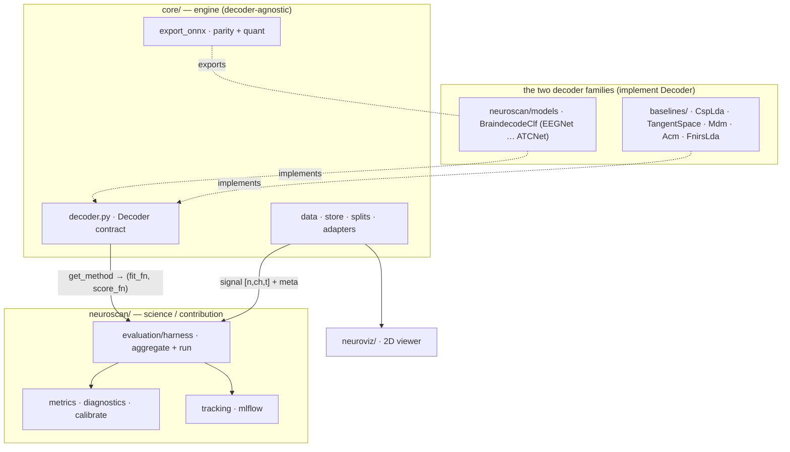
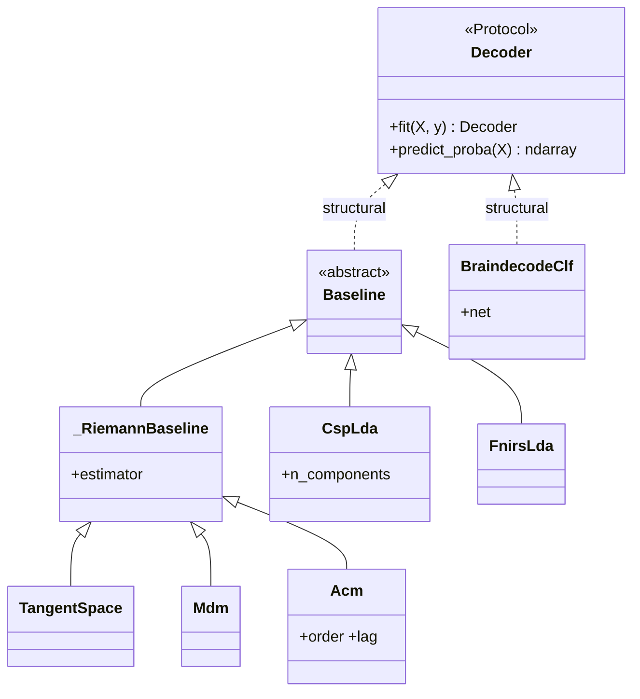

# mindscape — code structure

How the repo is laid out and why. The organizing idea: **the eval harness is the product, not the
model** — so the code separates a reusable, decoder-agnostic *engine* from the *science* layer where the
contribution (honest evaluation under shift) lives, and isolates the standard baseline it quarantines
against.

## Three layers
```
core/            the reusable engine — dataset- and decoder-agnostic plumbing + the Decoder contract
neuroscan/       the science/contribution layer — harness, metrics, calibration, decoders, tracking
baselines/       the quarantine ceiling — standard reported methods (CSP+LDA, Riemannian), kept separate
```

## Architecture at a glance
The harness is decoder-agnostic: it speaks one contract, `core.decoder.Decoder` (`fit(X,y)->self`,
`predict_proba(X)->probs`), that **both** decoder families satisfy — so classical baselines and deep nets
ride the same evaluation spine.



The contract and its implementers (the thing that lets one harness run both families):



_Diagrams are kept coarse (layer + contract) on purpose — they map to folders and the stable
`Decoder` seam, so they don't drift when a file is added._

### `core/` — the engine
| module | role |
|---|---|
| `core/config.py` | one data root (`paths.yaml` / `MINDSCAPE_DATA`), everything derived; cross-platform path translation; points MOABB's cache at `<root>/raw`. Also the **named-experiment registry** — `load_experiment(name)` over `experiments.yaml` (config-as-data; entrypoints take `--exp` not a flag per knob) |
| `core/data/store.py` | the **epoch cloud** — consolidates a dataset into a recipe-keyed cache (`processed/<ds>/<key>/` = per-subject npz + a meta CSV + a `channels.json` when the adapter exposes `channels()`, so the cache is self-describing / one-format), `gather()` pulls a split's epochs back in row order, `channels()` returns the montage names |
| `core/data/splits.py` | **split-as-criteria** — a split is the cloud *filtered* (`make_split(meta, test_subjects, test_sessions, …)`), not a named thing; within / cross-subject (LOSO) / cross-session are all the same function with different criteria |
| `core/data/eeg/base.py` | the canonical schema + `DatasetAdapter` protocol + a reusable MOABB motor-imagery adapter |
| `core/data/eeg/registry.py` | name → adapter; "add a dataset = one file + one line" |
| `core/data/eeg/braindecode_pre.py` | the braindecode-canonical preprocessing path (continuous-signal EMS → windows) for faithful reproductions |
| `core/data/registry.py` | unified name → adapter registry across modalities (EEG + fNIRS) — add a dataset = one factory + one line |
| `core/data/fnirs/` | the hemodynamic modality: `base.py` (FnirsCfg + bandpass/epoch), `shin2017.py` (Shin n-back adapter, parses HbO/HbR from the raw `.mat`) — same [n,ch,t]+meta schema, so the same store/harness ride on it |
| `core/decoder.py` | the **`Decoder` contract** — a structural `Protocol` (`fit(X,y)->self`, `predict_proba(X)->probs`) every model satisfies (classical baselines + braindecode nets); lives in `core` as the neutral vocabulary both implementer trees sit above (same layer as `export_onnx`, which also consumes a trained decoder) |
| `core/features.py` | **feature extraction** — the signal→feature substance the decoders sit on: covariances (`time_delay_embed`), manifold transfer transforms (`recenter_covariances`, `scale_to_identity`), EEG `band_powers` (θ/α/β), fNIRS `amplitude_features` (mean/slope/peak). Methods in `baselines/` are thin: they *call* these + bolt on a classifier (one extractor implementation, reused across methods/modalities/transfer/viz) |
| `core/export_onnx.py` | ONNX export + INT8 quant + a **parity gate** (optional edge-deploy tail, first-class not bolted on) |
| `core/reference.py` + `reference.yaml` | published SOTA ceilings as cited config, surfaced next to every result |

### `neuroscan/` — the science / contribution layer
| module | role |
|---|---|
| `evaluation/harness.py` | the spine — every decoder is a `(fit_fn, score_fn)` pair fed through one `aggregate()` (pure, testable) + `run()` (logs); builds folds for a regime |
| `evaluation/metrics.py` | accuracy, Cohen's κ, ECE/Brier, confusion — pure functions |
| `evaluation/diagnostics.py` | per-subject / per-session stratification + spread (where the mean hides the failure) |
| `evaluation/calibrate.py` | temperature scaling; measures whether an in-session calibration fix transfers across the session shift |
| `evaluation/modelcard.py` | an honest per-run card (headline, vs-reference, per-subject spread, where-it-fails) |
| `models/decoders.py` | one GPU trainer (AdamW + cosine, bf16, crop augmentation, early stopping, seed-averaging) behind the braindecode nets (EEGNet … ATCNet, EEGConformer); `BraindecodeClf` wraps each net as a `Decoder` (`fit`/`predict_proba`) |
| `models/transforms.py` | standardizers (z-score / EMS / identity) + sliding-window crops, independently testable |
| `models/__init__.py` | `get_method(name)` — one registry over the `core.decoder.Decoder` contract: baselines and nets share a single `predict_proba` scorer; only the builder differs (a fresh baseline object, or `decoders.make` for a net) |
| `tracking.py` | guarded local-sqlite MLflow (no-op if absent); `save_model` persists trained models (torch `.pt` / sklearn `.joblib`) to `runs/<name>/models/` + as an artifact |
| `tasks/` | thin CLIs organized **by decoding task**, each driven by a named config (`--exp <name>` from `experiments.yaml`, `--set k=v` for ad-hoc tweaks). Root: `run` (generic EEG decode — serves both tasks), `reproduce_all` (regenerate the canonical numbers by iterating the registry). `tasks/motor_imagery/`: `align` (cross-subject Riemannian re-centering), `reproduce_atcnet` (faithful reproduction), `quantize` (optional edge deploy). `tasks/workload/`: `run_fnirs` (fNIRS decode), `run_fusion` (EEG+fNIRS fusion + complementarity/aggregation sweep), `fusion_gate` (compact learned gate — honest negative), `repro_benchnirs` (BenchNIRS anchor), `calibration_ablation` (per-subject calibration = the EEG transfer lever) |

### `baselines/` and the rest
Method **objects**, not loose functions, **grouped by modality** and kept **thin** — each is a class owning
its hyperparameters (`__init__` args) that *calls a `core.features` extractor* + bolts on a classifier,
implementing `core.decoder.Decoder` via the `Baseline` ABC (so they run the same harness path as the nets).
Module-level `fit`/`score` remain as back-compat shims.
- `baselines/base.py` — the `Baseline` ABC (`fit(X,y)->self`, `predict_proba`); the classical side of the `Decoder` contract (shared across modalities).
- `baselines/eeg/csp_lda.py` — `CspLda(n_components)`: CSP + LDA, the standard motor-imagery reference.
- `baselines/eeg/riemann.py` — `TangentSpace` / `Mdm` / `Acm(order, lag)` off a shared `_RiemannBaseline` (covariance from `core.features`). The strongest classical baseline; cross-subject transfer (re-centering → RPA/MDWM) lives in `tasks/motor_imagery/align.py`.
- `baselines/eeg/bandpower.py` — `EegBandpower`: `core.features.band_powers` (θ/α/β) → scaler → LDA. The workload-native EEG feature; `relative=True` divides out per-epoch total power.
- `baselines/fnirs/features.py` — `FnirsLda`: `core.features.amplitude_features` (mean+slope+peak of ΔHbO/ΔHbR) → scaler → LDA. The amplitude covariance methods discard; the right tool for the hemodynamic modality.
- `baselines/fusion/` — EEG↔fNIRS combiners: `combine.py` (feature fusion, the output-space aggregator sweep, and the complementarity diagnostic) + `gate.py` (`GatedFusion`, the compact input-level gate). The transfer methods (`baselines/eeg/transfer.py`) and fusion methods keep a **different contract** from `Decoder` — they take domains / two aligned modalities / a calibration split — so they live as functions/objects here and the workload + `align` runners stay thin.
- `neuroviz/` — the 2D viewer, organized **task → modality**: Motor imagery → EEG; Mental workload → EEG (θ/α/β band-power) · fNIRS (HbO/HbR) · **Fusion** (per-block complementarity map). Topomaps + CSP/Riemann/LDA patterns + waveforms; exporters (`export`, `export_eeg_workload`, `export_fnirs`, `export_fusion`) read the processed store → dependency-free web app.
- `tests/` — a pyramid. `unit/` **mirrors the source tree** (`unit/core/data/test_store.py`, `unit/baselines/test_eeg_bandpower.py`, `unit/neuroscan/evaluation/test_metrics.py`, …) so a module's tests sit where the module does; equivalence-class per module. `integration/` stays **scenario-based** (flat — module chains: data→splits→harness, decoder→export→parity), since those cross the tree by design.

## The one idea everything hangs off — split-as-criteria
The honesty story is one design choice. A split isn't a named, fixed thing; it's the data cloud filtered
on criteria that live on the run config, so a run **self-documents what it held out**:

```python
make_split(meta, test_subjects=())            # within-subject ceiling (random val carve)
make_split(meta, test_subjects=["A03"])       # cross-subject — leave-one-subject-out (the OOD gap)
make_split(meta, test_sessions=["1test"])     # cross-session drift
```

Same `(fit_fn, score_fn)` contract across all three regimes; only the criteria change. No new harness per
regime — the evaluation *regime* is **data, not code**, which is exactly what makes the within→cross-subject
gap a first-class, auditable number rather than an afterthought.

## What's commodity vs the contribution
- **Commodity (don't reinvent):** the decoder architectures (braindecode), MOABB's datasets/splits, the
  ONNX/MLflow plumbing.
- **The contribution:** the harness + the regime model + calibration-under-shift + per-subject diagnostics
  — the layer that turns "I trained a net" into "here is exactly how far it generalizes, and where it fails."
