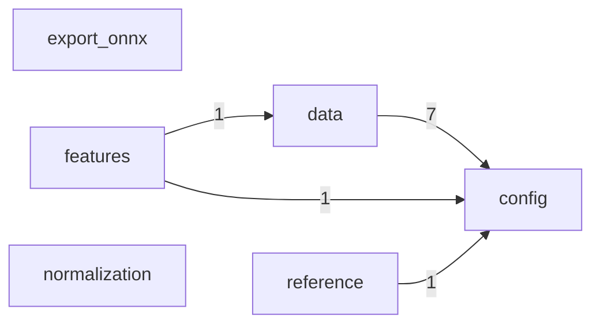

# Architecture — `core`

```mermaid
graph LR
  core_config["config"]
  core_data["data"]
  core_export_onnx["export_onnx"]
  core_features["features"]
  core_normalization["normalization"]
  core_reference["reference"]
  core_data -->|7| core_config
  core_features -->|1| core_config
  core_features -->|1| core_data
  core_reference -->|1| core_config
  click core_data "./data/ARCHITECTURE.md"
  click core_features "./features/ARCHITECTURE.md"
  click core_normalization "./normalization/ARCHITECTURE.md"
```

**Drill:** [data](./data/ARCHITECTURE.md) · [features](./features/ARCHITECTURE.md) · [normalization](./normalization/ARCHITECTURE.md)
