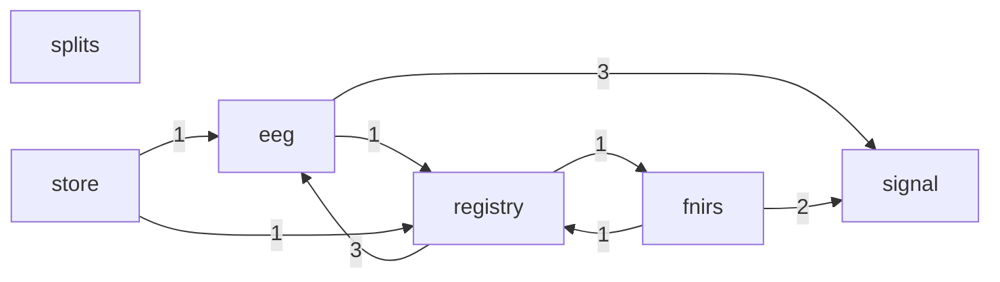

# Architecture — `core.data`

```mermaid
graph LR
  core_data_eeg["eeg"]
  core_data_fnirs["fnirs"]
  core_data_registry["registry"]
  core_data_signal["signal"]
  core_data_splits["splits"]
  core_data_store["store"]
  core_data_eeg -->|1| core_data_registry
  core_data_eeg -->|3| core_data_signal
  core_data_fnirs -->|1| core_data_registry
  core_data_fnirs -->|2| core_data_signal
  core_data_registry -->|3| core_data_eeg
  core_data_registry -->|1| core_data_fnirs
  core_data_store -->|1| core_data_eeg
  core_data_store -->|1| core_data_registry
  click core_data_eeg "./eeg/ARCHITECTURE.md"
  click core_data_fnirs "./fnirs/ARCHITECTURE.md"
```

**Drill:** [eeg](./eeg/ARCHITECTURE.md) · [fnirs](./fnirs/ARCHITECTURE.md)
