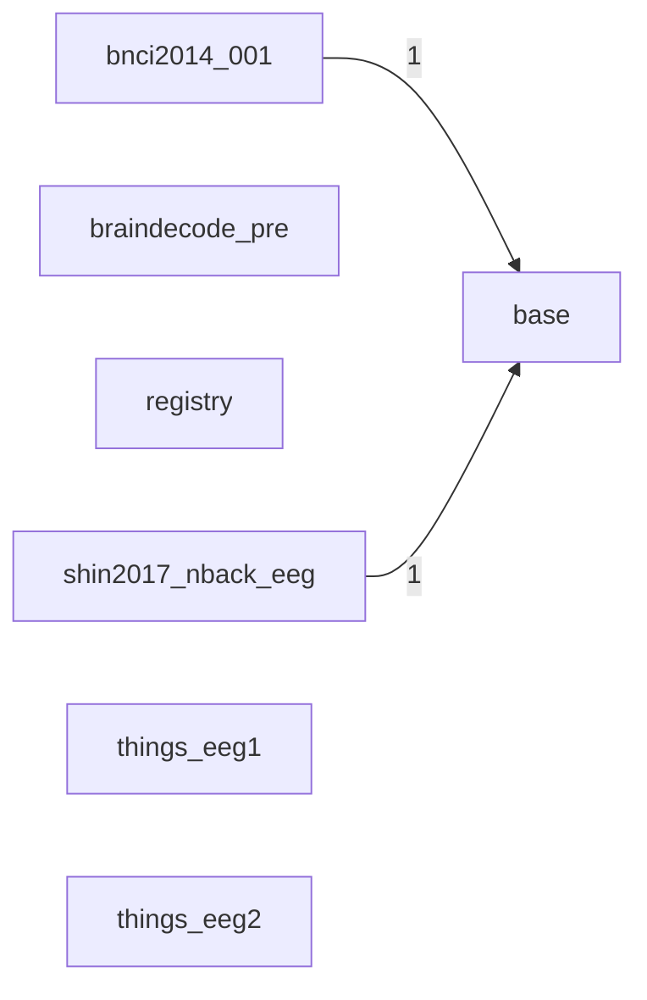

# Architecture — `core.data.eeg`

```mermaid
graph LR
  core_data_eeg_base["base"]
  core_data_eeg_bnci2014_001["bnci2014_001"]
  core_data_eeg_braindecode_pre["braindecode_pre"]
  core_data_eeg_registry["registry"]
  core_data_eeg_shin2017_nback_eeg["shin2017_nback_eeg"]
  core_data_eeg_things_eeg1["things_eeg1"]
  core_data_eeg_things_eeg2["things_eeg2"]
  core_data_eeg_bnci2014_001 -->|1| core_data_eeg_base
  core_data_eeg_shin2017_nback_eeg -->|1| core_data_eeg_base
```
