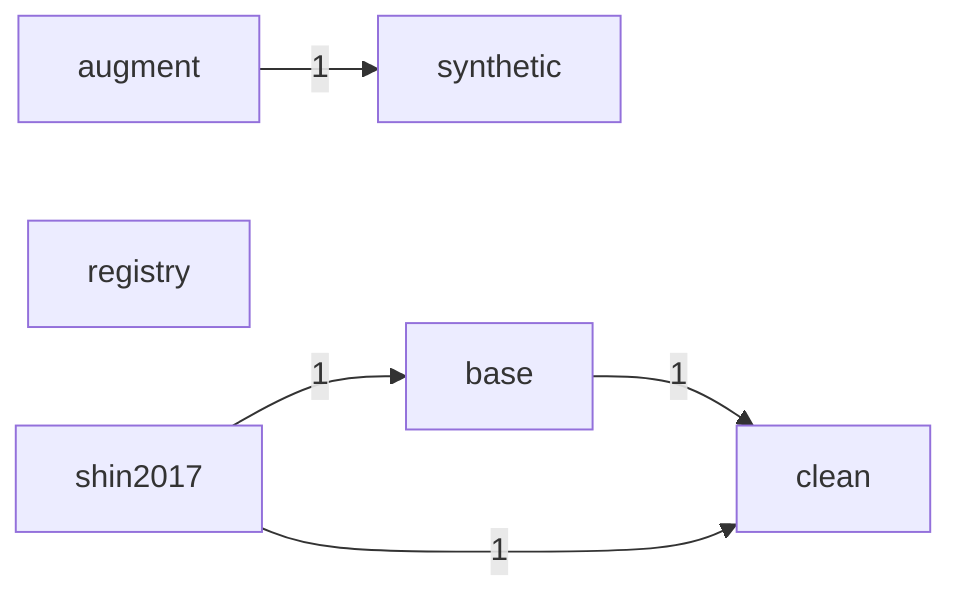

# Architecture — `core.data.fnirs`

```mermaid
graph LR
  core_data_fnirs_augment["augment"]
  core_data_fnirs_base["base"]
  core_data_fnirs_clean["clean"]
  core_data_fnirs_registry["registry"]
  core_data_fnirs_shin2017["shin2017"]
  core_data_fnirs_synthetic["synthetic"]
  core_data_fnirs_augment -->|1| core_data_fnirs_synthetic
  core_data_fnirs_base -->|1| core_data_fnirs_clean
  core_data_fnirs_shin2017 -->|1| core_data_fnirs_base
  core_data_fnirs_shin2017 -->|1| core_data_fnirs_clean
```
