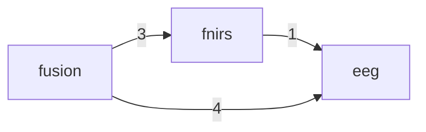

# Architecture — `core.features`

```mermaid
graph LR
  core_features_eeg["eeg"]
  core_features_fnirs["fnirs"]
  core_features_fusion["fusion"]
  core_features_fnirs -->|1| core_features_eeg
  core_features_fusion -->|4| core_features_eeg
  core_features_fusion -->|3| core_features_fnirs
  click core_features_eeg "./eeg/ARCHITECTURE.md"
  click core_features_fnirs "./fnirs/ARCHITECTURE.md"
  click core_features_fusion "./fusion/ARCHITECTURE.md"
```

**Drill:** [eeg](./eeg/ARCHITECTURE.md) · [fnirs](./fnirs/ARCHITECTURE.md) · [fusion](./fusion/ARCHITECTURE.md)
