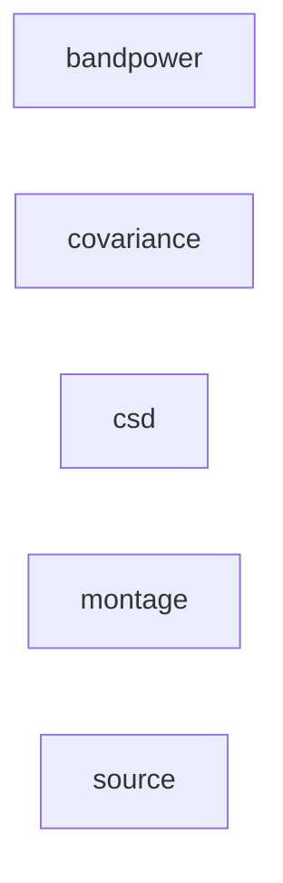

# Architecture — `core.features.eeg`

```mermaid
graph LR
  core_features_eeg_bandpower["bandpower"]
  core_features_eeg_covariance["covariance"]
  core_features_eeg_csd["csd"]
  core_features_eeg_montage["montage"]
  core_features_eeg_source["source"]
```
