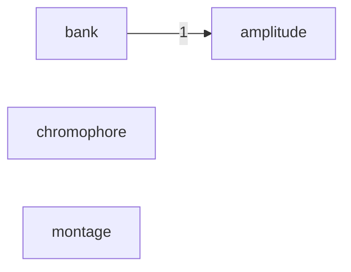

# Architecture — `core.features.fnirs`

```mermaid
graph LR
  core_features_fnirs_amplitude["amplitude"]
  core_features_fnirs_bank["bank"]
  core_features_fnirs_chromophore["chromophore"]
  core_features_fnirs_montage["montage"]
  core_features_fnirs_bank -->|1| core_features_fnirs_amplitude
```
