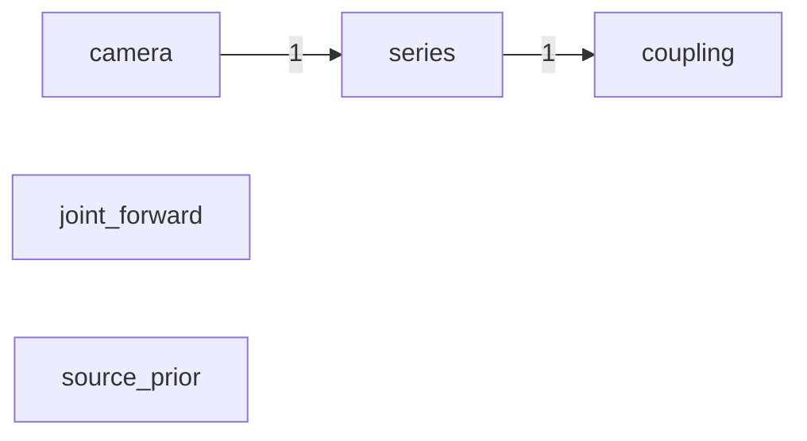

# Architecture — `core.features.fusion`

```mermaid
graph LR
  core_features_fusion_camera["camera"]
  core_features_fusion_coupling["coupling"]
  core_features_fusion_joint_forward["joint_forward"]
  core_features_fusion_series["series"]
  core_features_fusion_source_prior["source_prior"]
  core_features_fusion_camera -->|1| core_features_fusion_series
  core_features_fusion_series -->|1| core_features_fusion_coupling
```
