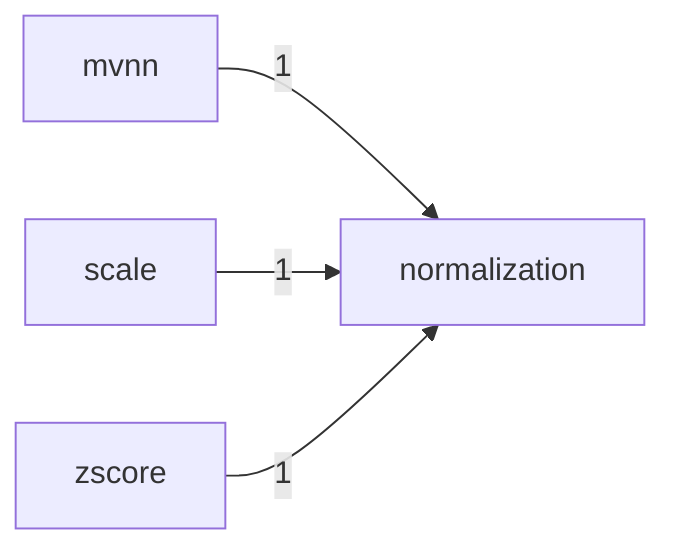

# Architecture — `core.normalization`

```mermaid
graph LR
  core_normalization_mvnn["mvnn"]
  core_normalization_normalization["normalization"]
  core_normalization_scale["scale"]
  core_normalization_zscore["zscore"]
  core_normalization_mvnn -->|1| core_normalization_normalization
  core_normalization_scale -->|1| core_normalization_normalization
  core_normalization_zscore -->|1| core_normalization_normalization
```
