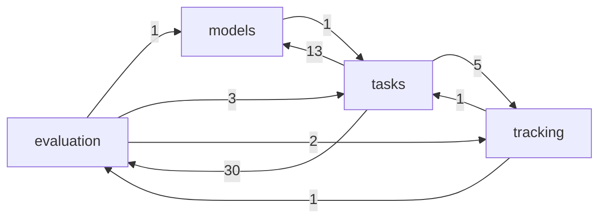

# Architecture — `neuroscan`

```mermaid
graph LR
  neuroscan_evaluation["evaluation"]
  neuroscan_models["models"]
  neuroscan_tasks["tasks"]
  neuroscan_tracking["tracking"]
  neuroscan_evaluation -->|1| neuroscan_models
  neuroscan_evaluation -->|3| neuroscan_tasks
  neuroscan_evaluation -->|2| neuroscan_tracking
  neuroscan_models -->|1| neuroscan_tasks
  neuroscan_tasks -->|30| neuroscan_evaluation
  neuroscan_tasks -->|13| neuroscan_models
  neuroscan_tasks -->|5| neuroscan_tracking
  neuroscan_tracking -->|1| neuroscan_evaluation
  neuroscan_tracking -->|1| neuroscan_tasks
  click neuroscan_evaluation "./evaluation/ARCHITECTURE.md"
  click neuroscan_models "./models/ARCHITECTURE.md"
  click neuroscan_tasks "./tasks/ARCHITECTURE.md"
```

**Drill:** [evaluation](./evaluation/ARCHITECTURE.md) · [models](./models/ARCHITECTURE.md) · [tasks](./tasks/ARCHITECTURE.md)
