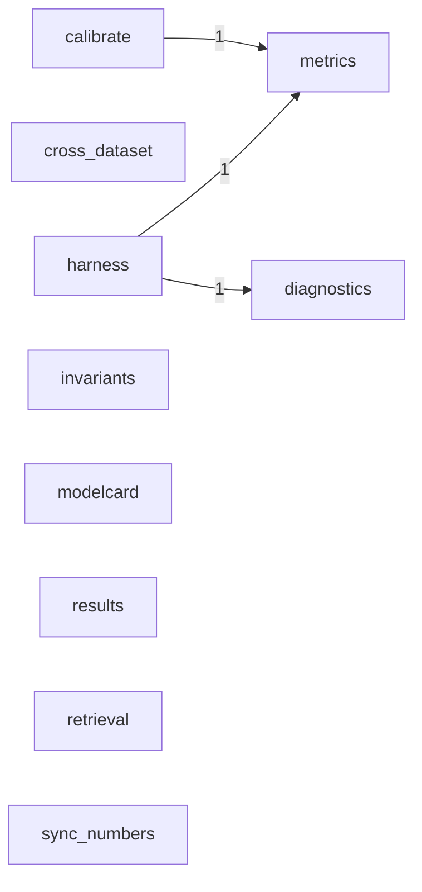

# Architecture — `neuroscan.evaluation`

```mermaid
graph LR
  neuroscan_evaluation_calibrate["calibrate"]
  neuroscan_evaluation_cross_dataset["cross_dataset"]
  neuroscan_evaluation_diagnostics["diagnostics"]
  neuroscan_evaluation_harness["harness"]
  neuroscan_evaluation_invariants["invariants"]
  neuroscan_evaluation_metrics["metrics"]
  neuroscan_evaluation_modelcard["modelcard"]
  neuroscan_evaluation_results["results"]
  neuroscan_evaluation_retrieval["retrieval"]
  neuroscan_evaluation_sync_numbers["sync_numbers"]
  neuroscan_evaluation_calibrate -->|1| neuroscan_evaluation_metrics
  neuroscan_evaluation_harness -->|1| neuroscan_evaluation_diagnostics
  neuroscan_evaluation_harness -->|1| neuroscan_evaluation_metrics
```
