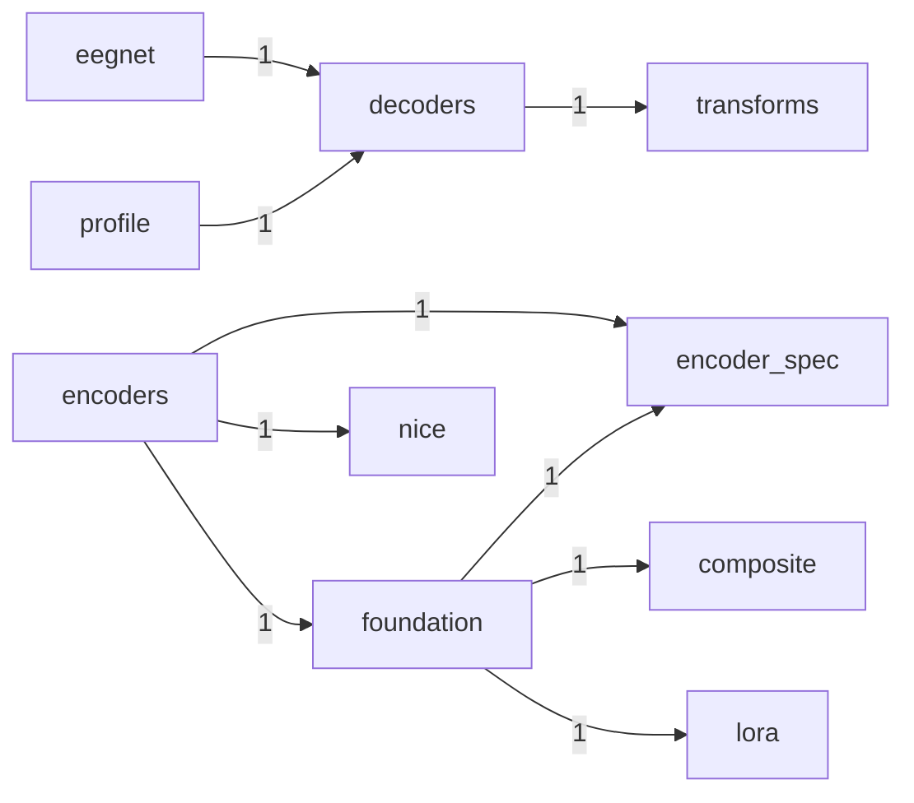

# Architecture — `neuroscan.models`

```mermaid
graph LR
  neuroscan_models_composite["composite"]
  neuroscan_models_decoders["decoders"]
  neuroscan_models_eegnet["eegnet"]
  neuroscan_models_encoder_spec["encoder_spec"]
  neuroscan_models_encoders["encoders"]
  neuroscan_models_foundation["foundation"]
  neuroscan_models_lora["lora"]
  neuroscan_models_nice["nice"]
  neuroscan_models_profile["profile"]
  neuroscan_models_transforms["transforms"]
  neuroscan_models_decoders -->|1| neuroscan_models_transforms
  neuroscan_models_eegnet -->|1| neuroscan_models_decoders
  neuroscan_models_encoders -->|1| neuroscan_models_encoder_spec
  neuroscan_models_encoders -->|1| neuroscan_models_foundation
  neuroscan_models_encoders -->|1| neuroscan_models_nice
  neuroscan_models_foundation -->|1| neuroscan_models_composite
  neuroscan_models_foundation -->|1| neuroscan_models_encoder_spec
  neuroscan_models_foundation -->|1| neuroscan_models_lora
  neuroscan_models_profile -->|1| neuroscan_models_decoders
```
