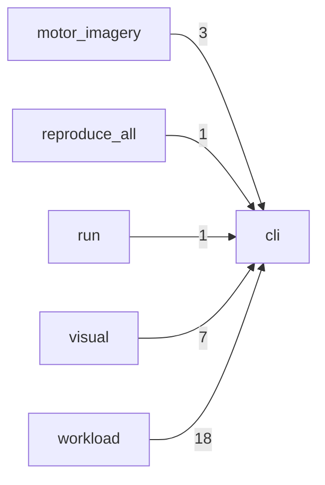

# Architecture — `neuroscan.tasks`

```mermaid
graph LR
  neuroscan_tasks_cli["cli"]
  neuroscan_tasks_motor_imagery["motor_imagery"]
  neuroscan_tasks_reproduce_all["reproduce_all"]
  neuroscan_tasks_run["run"]
  neuroscan_tasks_visual["visual"]
  neuroscan_tasks_workload["workload"]
  neuroscan_tasks_motor_imagery -->|3| neuroscan_tasks_cli
  neuroscan_tasks_reproduce_all -->|1| neuroscan_tasks_cli
  neuroscan_tasks_run -->|1| neuroscan_tasks_cli
  neuroscan_tasks_visual -->|7| neuroscan_tasks_cli
  neuroscan_tasks_workload -->|18| neuroscan_tasks_cli
  click neuroscan_tasks_motor_imagery "./motor_imagery/ARCHITECTURE.md"
  click neuroscan_tasks_visual "./visual/ARCHITECTURE.md"
  click neuroscan_tasks_workload "./workload/ARCHITECTURE.md"
```

**Drill:** [motor_imagery](./motor_imagery/ARCHITECTURE.md) · [visual](./visual/ARCHITECTURE.md) · [workload](./workload/ARCHITECTURE.md)
