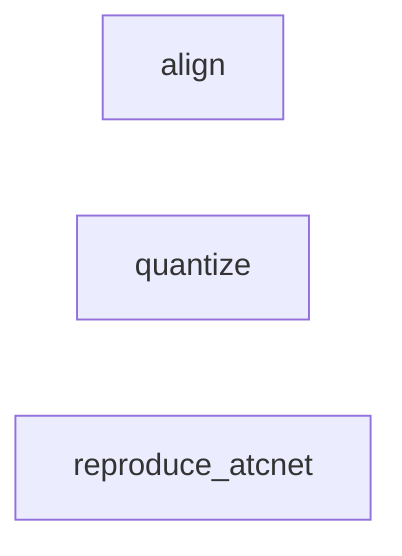

# Architecture — `neuroscan.tasks.motor_imagery`

```mermaid
graph LR
  neuroscan_tasks_motor_imagery_align["align"]
  neuroscan_tasks_motor_imagery_quantize["quantize"]
  neuroscan_tasks_motor_imagery_reproduce_atcnet["reproduce_atcnet"]
```
