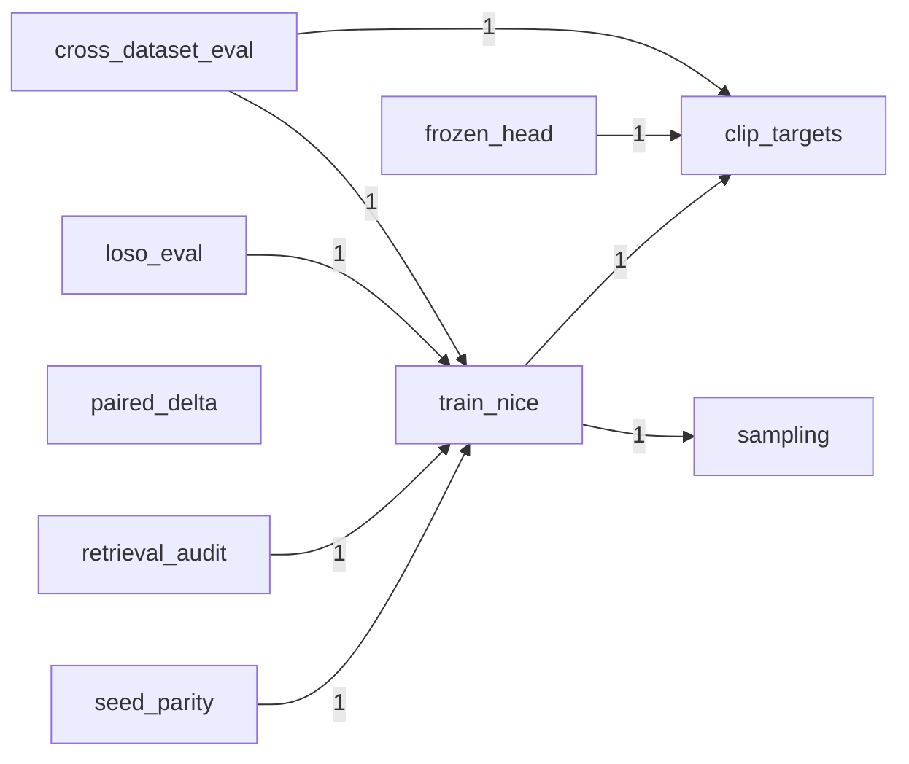

# Architecture — `neuroscan.tasks.visual`

```mermaid
graph LR
  neuroscan_tasks_visual_clip_targets["clip_targets"]
  neuroscan_tasks_visual_cross_dataset_eval["cross_dataset_eval"]
  neuroscan_tasks_visual_frozen_head["frozen_head"]
  neuroscan_tasks_visual_loso_eval["loso_eval"]
  neuroscan_tasks_visual_paired_delta["paired_delta"]
  neuroscan_tasks_visual_retrieval_audit["retrieval_audit"]
  neuroscan_tasks_visual_sampling["sampling"]
  neuroscan_tasks_visual_seed_parity["seed_parity"]
  neuroscan_tasks_visual_train_nice["train_nice"]
  neuroscan_tasks_visual_cross_dataset_eval -->|1| neuroscan_tasks_visual_clip_targets
  neuroscan_tasks_visual_cross_dataset_eval -->|1| neuroscan_tasks_visual_train_nice
  neuroscan_tasks_visual_frozen_head -->|1| neuroscan_tasks_visual_clip_targets
  neuroscan_tasks_visual_loso_eval -->|1| neuroscan_tasks_visual_train_nice
  neuroscan_tasks_visual_retrieval_audit -->|1| neuroscan_tasks_visual_train_nice
  neuroscan_tasks_visual_seed_parity -->|1| neuroscan_tasks_visual_train_nice
  neuroscan_tasks_visual_train_nice -->|1| neuroscan_tasks_visual_clip_targets
  neuroscan_tasks_visual_train_nice -->|1| neuroscan_tasks_visual_sampling
```
