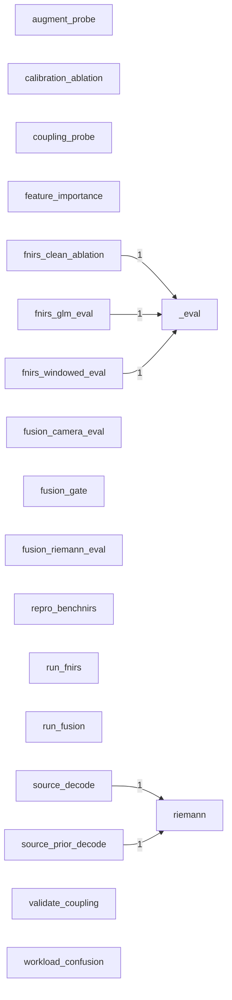

# Architecture — `neuroscan.tasks.workload`

```mermaid
graph LR
  neuroscan_tasks_workload__eval["_eval"]
  neuroscan_tasks_workload_augment_probe["augment_probe"]
  neuroscan_tasks_workload_calibration_ablation["calibration_ablation"]
  neuroscan_tasks_workload_coupling_probe["coupling_probe"]
  neuroscan_tasks_workload_feature_importance["feature_importance"]
  neuroscan_tasks_workload_fnirs_clean_ablation["fnirs_clean_ablation"]
  neuroscan_tasks_workload_fnirs_glm_eval["fnirs_glm_eval"]
  neuroscan_tasks_workload_fnirs_windowed_eval["fnirs_windowed_eval"]
  neuroscan_tasks_workload_fusion_camera_eval["fusion_camera_eval"]
  neuroscan_tasks_workload_fusion_gate["fusion_gate"]
  neuroscan_tasks_workload_fusion_riemann_eval["fusion_riemann_eval"]
  neuroscan_tasks_workload_repro_benchnirs["repro_benchnirs"]
  neuroscan_tasks_workload_riemann["riemann"]
  neuroscan_tasks_workload_run_fnirs["run_fnirs"]
  neuroscan_tasks_workload_run_fusion["run_fusion"]
  neuroscan_tasks_workload_source_decode["source_decode"]
  neuroscan_tasks_workload_source_prior_decode["source_prior_decode"]
  neuroscan_tasks_workload_validate_coupling["validate_coupling"]
  neuroscan_tasks_workload_workload_confusion["workload_confusion"]
  neuroscan_tasks_workload_fnirs_clean_ablation -->|1| neuroscan_tasks_workload__eval
  neuroscan_tasks_workload_fnirs_glm_eval -->|1| neuroscan_tasks_workload__eval
  neuroscan_tasks_workload_fnirs_windowed_eval -->|1| neuroscan_tasks_workload__eval
  neuroscan_tasks_workload_source_decode -->|1| neuroscan_tasks_workload_riemann
  neuroscan_tasks_workload_source_prior_decode -->|1| neuroscan_tasks_workload_riemann
  click neuroscan_tasks_workload_feature_importance "./feature_importance/ARCHITECTURE.md"
```

**Drill:** [feature_importance](./feature_importance/ARCHITECTURE.md)
