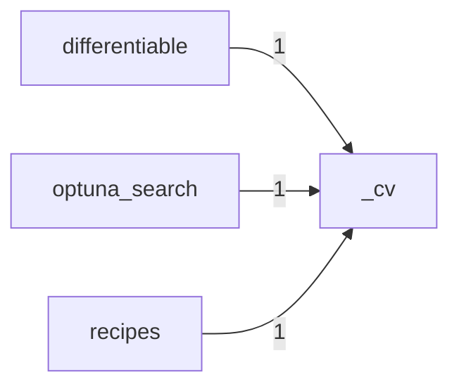

# Architecture — `neuroscan.tasks.workload.feature_importance`

```mermaid
graph LR
  neuroscan_tasks_workload_feature_importance__cv["_cv"]
  neuroscan_tasks_workload_feature_importance_differentiable["differentiable"]
  neuroscan_tasks_workload_feature_importance_optuna_search["optuna_search"]
  neuroscan_tasks_workload_feature_importance_recipes["recipes"]
  neuroscan_tasks_workload_feature_importance_differentiable -->|1| neuroscan_tasks_workload_feature_importance__cv
  neuroscan_tasks_workload_feature_importance_optuna_search -->|1| neuroscan_tasks_workload_feature_importance__cv
  neuroscan_tasks_workload_feature_importance_recipes -->|1| neuroscan_tasks_workload_feature_importance__cv
```
