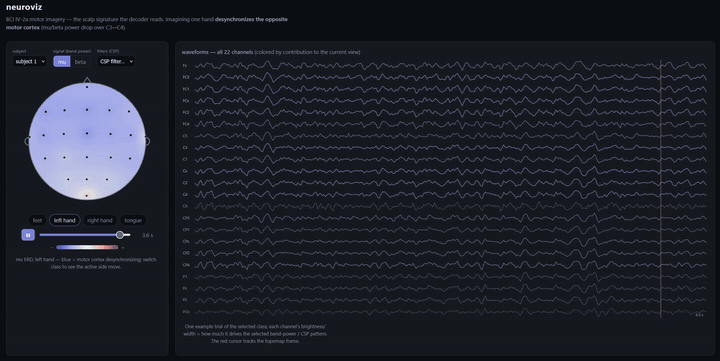

# neuroviz

The motor-imagery EEG viewer — the field-standard 2D views of the signal the decoder reads
(an in-browser viewer of the data the model consumes). 2D topographic maps, not a 3D head: EEG scalp data is
inherently 2D-surface, and topomaps are what the field actually uses.



**Shows, for a BCI IV-2a subject:**
- **Band-power topomaps** (mu 8–12 Hz, beta 13–30 Hz) per class — the motor-imagery signature: imagining
  one hand desynchronizes the *contralateral* motor cortex (the hot spot flips C3↔C4 between left/right hand).
- **CSP spatial patterns** — what the baseline decoder actually learns (should localize over C3/C4 →
  physiologically real features, not artifacts).
- **Waveforms** at C3/Cz/C4 for an example trial.

## Run
```bash
# 1) export a subject's view data (writes neuroviz/web/data/, gitignored)
uv run python -m neuroviz.export --subject 1
uv run python -m neuroviz.export --subject 3

# 2) serve + open
python -m http.server 8000 -d neuroviz/web      # then open http://localhost:8000
```

The web app is dependency-free (vanilla JS + canvas, no build step); the topomap is an inverse-distance
interpolation of the 22 electrodes over the scalp circle.

_The viewer makes the neuroscience visible; the contribution remains the honest cross-subject evaluation,
not the picture._
